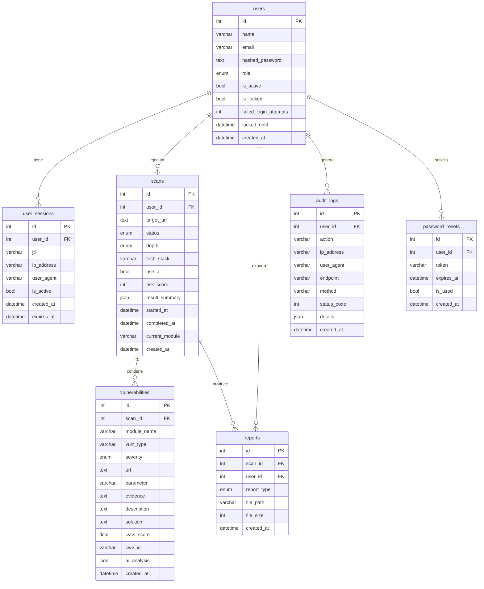

<center>


**UNIVERSIDAD PRIVADA DE TACNA**

**FACULTAD DE INGENIERÍA**

**Escuela Profesional de Ingeniería de Sistemas**

**Proyecto: Analizador de Vulnerabilidades Web — VulnScan Pro**

Curso: *Calidad y Pruebas de Software*

Docente: *Ing. Patrick Jose Cuadros Quiroga*

Integrantes:

**Ramos Loza, Mariela Estefany (2023077478)**

**Calloticona Chambilla, Marymar D. (2023076791)**

**Tacna – Perú**

**2026**

</center>

<div style="page-break-after: always;"></div>

---

**Sistema: Analizador de Vulnerabilidades Web — VulnScan Pro**

**Diccionario de Datos**

Versión 1.0

| CONTROL DE VERSIONES | | | | | |
|:---:|:---|:---|:---|:---|:---|
| Versión | Hecha por | Revisada por | Aprobada por | Fecha | Motivo |
| 1.0 | M. Calloticona | M. Ramos | | 04/04/2026 | Versión Original |

<div style="page-break-after: always;"></div>

---

## ÍNDICE GENERAL

[1. Introducción](#1-introducción)

[2. Convenciones](#2-convenciones)

[3. Tablas de la Base de Datos](#3-tablas-de-la-base-de-datos)

- [3.1 Tabla: users](#31-tabla-users)
- [3.2 Tabla: user_sessions](#32-tabla-user_sessions)
- [3.3 Tabla: scans](#33-tabla-scans)
- [3.4 Tabla: vulnerabilities](#34-tabla-vulnerabilities)
- [3.5 Tabla: audit_logs](#35-tabla-audit_logs)
- [3.6 Tabla: reports](#36-tabla-reports)
- [3.7 Tabla: password_resets](#37-tabla-password_resets)

[4. Diagrama de Relaciones](#4-diagrama-de-relaciones)

[5. Enumeraciones y Dominios](#5-enumeraciones-y-dominios)

<div style="page-break-after: always;"></div>

---

## 1. Introducción

El presente Diccionario de Datos documenta de forma detallada la estructura de la base de datos **vulnscan_db** del sistema VulnScan Pro — Analizador de Vulnerabilidades Web. Describe cada tabla, sus columnas, tipos de datos, restricciones, índices y relaciones.

**Motor de base de datos:** MySQL 8.0  
**ORM:** SQLAlchemy 2.0 con QueuePool (pool_size=10, max_overflow=20)  
**Charset:** utf8mb4  
**Collation:** utf8mb4_unicode_ci  
**Servidor:** VPS Linux — IP 149.34.48.176, puerto 3306 (acceso solo desde localhost)

El esquema contiene **7 tablas** que modelan los siguientes conceptos del dominio: usuarios y sus sesiones, escaneos de vulnerabilidades, vulnerabilidades detectadas, registros de auditoría, reportes exportados y tokens de recuperación de contraseña.

---

## 2. Convenciones

| Convención | Descripción |
|:-----------|:------------|
| **PK** | Primary Key — clave primaria, autoincrementada |
| **FK** | Foreign Key — clave foránea que referencia otra tabla |
| **NN** | Not Null — el campo no puede ser nulo |
| **UQ** | Unique — valor único en la tabla |
| **IDX** | Indexed — columna con índice para optimizar consultas |
| **DEFAULT** | Valor por defecto cuando no se especifica |
| Los nombres de tablas usan **snake_case** en plural |
| Los nombres de columnas usan **snake_case** |
| Los tipos ENUM se documentan con sus valores posibles |

---

## 3. Tablas de la Base de Datos

### 3.1 Tabla: `users`

**Descripción:** Almacena los usuarios registrados en el sistema. Gestiona autenticación, roles y estado de bloqueo por intentos fallidos.

**Modelo SQLAlchemy:** `User` (definido en `backend/models.py`)

| # | Columna | Tipo | Long. | Nulo | Restricción | Default | Descripción |
|:-:|:--------|:-----|:-----:|:----:|:-----------:|:-------:|:------------|
| 1 | `id` | INT | — | NN | PK, AUTO_INCREMENT | — | Identificador único del usuario |
| 2 | `name` | VARCHAR | 100 | NN | — | — | Nombre completo del usuario |
| 3 | `email` | VARCHAR | 150 | NN | UQ, IDX | — | Correo electrónico — usado como credencial de login |
| 4 | `hashed_password` | TEXT | — | NN | — | — | Contraseña hasheada con bcrypt (cost=10) |
| 5 | `role` | ENUM | — | NN | — | `'user'` | Rol del usuario en el sistema |
| 6 | `is_active` | BOOLEAN | — | NN | — | `TRUE` | Indica si la cuenta está activa |
| 7 | `is_locked` | BOOLEAN | — | NN | — | `FALSE` | Indica si la cuenta está bloqueada por intentos fallidos |
| 8 | `failed_login_attempts` | INT | — | NN | — | `0` | Contador de intentos de login fallidos consecutivos |
| 9 | `locked_until` | DATETIME | — | SÍ | — | `NULL` | Fecha/hora hasta la que la cuenta permanece bloqueada |
| 10 | `created_at` | DATETIME | — | NN | IDX | `NOW()` | Fecha y hora de creación del registro |

**Valores del ENUM `role`:**

| Valor | Descripción |
|:------|:------------|
| `'user'` | Usuario estándar — solo ve sus propios escaneos |
| `'analyst'` | Analista — configuración avanzada de escaneos |
| `'admin'` | Administrador — control total del sistema |

**Índices:**

| Nombre | Columnas | Tipo |
|:-------|:---------|:-----|
| `PRIMARY` | `id` | PRIMARY |
| `uq_users_email` | `email` | UNIQUE |
| `idx_users_created_at` | `created_at` | INDEX |

**Reglas de negocio asociadas:** RN-03 (contraseñas), RN-04 (bloqueo 5 intentos / 15 min), RN-10 (no eliminar último admin)

---

### 3.2 Tabla: `user_sessions`

**Descripción:** Registra las sesiones JWT activas de cada usuario. Permite revocar tokens individuales o todas las sesiones de un usuario sin necesidad de cambiar la clave secreta JWT.

**Modelo SQLAlchemy:** `UserSession` (definido en `backend/models.py`)

| # | Columna | Tipo | Long. | Nulo | Restricción | Default | Descripción |
|:-:|:--------|:-----|:-----:|:----:|:-----------:|:-------:|:------------|
| 1 | `id` | INT | — | NN | PK, AUTO_INCREMENT | — | Identificador único de la sesión |
| 2 | `user_id` | INT | — | NN | FK → users.id, IDX | — | Usuario al que pertenece la sesión |
| 3 | `jti` | VARCHAR | 255 | NN | UQ | — | JWT ID único del token (claim `jti`) |
| 4 | `ip_address` | VARCHAR | 45 | NN | — | — | Dirección IP del cliente al iniciar sesión |
| 5 | `user_agent` | VARCHAR | 500 | SÍ | — | `NULL` | User-Agent del navegador del cliente |
| 6 | `is_active` | BOOLEAN | — | NN | IDX | `TRUE` | Indica si la sesión está activa (no revocada) |
| 7 | `created_at` | DATETIME | — | NN | — | `NOW()` | Fecha y hora de creación de la sesión |
| 8 | `expires_at` | DATETIME | — | NN | — | — | Fecha y hora de expiración del JWT (created_at + 24h) |

**Índices:**

| Nombre | Columnas | Tipo |
|:-------|:---------|:-----|
| `PRIMARY` | `id` | PRIMARY |
| `uq_user_sessions_jti` | `jti` | UNIQUE |
| `idx_user_sessions_user_id` | `user_id` | INDEX |
| `idx_user_sessions_is_active` | `is_active` | INDEX |

**Relaciones:**

| Columna | Referencia | ON DELETE | ON UPDATE |
|:--------|:-----------|:---------:|:---------:|
| `user_id` | `users.id` | CASCADE | CASCADE |

**Reglas de negocio asociadas:** RN-05 (JWT 24h), RN-09 (revocación de sesiones)

---

### 3.3 Tabla: `scans`

**Descripción:** Registra cada escaneo de vulnerabilidades ejecutado en el sistema. Gestiona el ciclo de vida del proceso: pending → in_progress → completed / failed.

**Modelo SQLAlchemy:** `Scan` (definido en `backend/models.py`)

| # | Columna | Tipo | Long. | Nulo | Restricción | Default | Descripción |
|:-:|:--------|:-----|:-----:|:----:|:-----------:|:-------:|:------------|
| 1 | `id` | INT | — | NN | PK, AUTO_INCREMENT | — | Identificador único del escaneo |
| 2 | `user_id` | INT | — | NN | FK → users.id, IDX | — | Usuario que inició el escaneo |
| 3 | `target_url` | TEXT | — | NN | — | — | URL objetivo del escaneo (ej: https://mi-app.com) |
| 4 | `status` | ENUM | — | NN | IDX | `'pending'` | Estado actual del escaneo |
| 5 | `depth` | ENUM | — | NN | — | `'standard'` | Nivel de profundidad del escaneo |
| 6 | `tech_stack` | VARCHAR | 100 | SÍ | — | `NULL` | Stack tecnológico declarado (php, python, nodejs, java) |
| 7 | `use_ai` | BOOLEAN | — | NN | — | `FALSE` | Indica si el análisis IA está habilitado para este escaneo |
| 8 | `risk_score` | INT | — | NN | — | `0` | Puntuación de riesgo global (0-100) calculada al finalizar |
| 9 | `result_summary` | JSON | — | SÍ | — | `NULL` | Resumen ejecutivo del escaneo en formato JSON (incluye ai_report) |
| 10 | `started_at` | DATETIME | — | SÍ | — | `NULL` | Fecha/hora de inicio de ejecución del escaneo |
| 11 | `completed_at` | DATETIME | — | SÍ | — | `NULL` | Fecha/hora de finalización del escaneo |
| 12 | `current_module` | VARCHAR | 100 | SÍ | — | `NULL` | Nombre del módulo OWASP ejecutándose actualmente (para polling) |
| 13 | `created_at` | DATETIME | — | NN | IDX | `NOW()` | Fecha y hora de creación del registro |

**Valores del ENUM `status`:**

| Valor | Descripción |
|:------|:------------|
| `'pending'` | Escaneo creado, esperando inicio del BackgroundTask |
| `'in_progress'` | Escaneo en ejecución — módulos OWASP corriendo |
| `'completed'` | Escaneo finalizado exitosamente con resultados |
| `'failed'` | Escaneo terminado con error irrecuperable |

**Valores del ENUM `depth`:**

| Valor | Descripción |
|:------|:------------|
| `'basic'` | Módulos rápidos: headers, ssl, sensitive_files, error_disclosure |
| `'standard'` | Módulos estándar: básico + xss, sqli, csrf, open_redirect, http_methods |
| `'full'` | Todos los módulos: estándar + ssrf, lfi, cmd_injection, crawl |

**Fórmula risk_score:** `min(100, Σ(Críticas×10 + Altas×7 + Medias×3 + Bajas×1))`

**Índices:**

| Nombre | Columnas | Tipo |
|:-------|:---------|:-----|
| `PRIMARY` | `id` | PRIMARY |
| `idx_scans_user_id` | `user_id` | INDEX |
| `idx_scans_status` | `status` | INDEX |
| `idx_scans_created_at` | `created_at` | INDEX |

**Relaciones:**

| Columna | Referencia | ON DELETE | ON UPDATE |
|:--------|:-----------|:---------:|:---------:|
| `user_id` | `users.id` | CASCADE | CASCADE |

**Reglas de negocio asociadas:** RN-02 (1 escaneo activo por usuario), RN-06 (no IPs privadas), RN-07 (timeout por módulo), RN-16 (risk score 0-100)

---

### 3.4 Tabla: `vulnerabilities`

**Descripción:** Almacena cada vulnerabilidad detectada por los módulos de escaneo. Cada registro corresponde a un hallazgo específico con su evidencia técnica y, opcionalmente, el análisis generado por DeepSeek AI.

**Modelo SQLAlchemy:** `Vulnerability` (definido en `backend/models.py`)

| # | Columna | Tipo | Long. | Nulo | Restricción | Default | Descripción |
|:-:|:--------|:-----|:-----:|:----:|:-----------:|:-------:|:------------|
| 1 | `id` | INT | — | NN | PK, AUTO_INCREMENT | — | Identificador único de la vulnerabilidad |
| 2 | `scan_id` | INT | — | NN | FK → scans.id, IDX | — | Escaneo al que pertenece la vulnerabilidad |
| 3 | `module_name` | VARCHAR | 100 | NN | IDX | — | Módulo OWASP que detectó la vulnerabilidad |
| 4 | `vuln_type` | VARCHAR | 200 | NN | — | — | Tipo de vulnerabilidad (ej: SQL Injection, XSS Reflejado) |
| 5 | `severity` | ENUM | — | NN | IDX | — | Nivel de severidad de la vulnerabilidad |
| 6 | `url` | TEXT | — | NN | — | — | URL exacta donde se detectó la vulnerabilidad |
| 7 | `parameter` | VARCHAR | 500 | SÍ | — | `NULL` | Parámetro o campo afectado (GET, POST, header) |
| 8 | `evidence` | TEXT | — | SÍ | — | `NULL` | Evidencia técnica: payload usado, respuesta del servidor |
| 9 | `description` | TEXT | — | NN | — | — | Descripción técnica de la vulnerabilidad |
| 10 | `solution` | TEXT | — | NN | — | — | Solución básica recomendada (sin IA) |
| 11 | `cvss_score` | FLOAT | — | SÍ | — | `NULL` | Puntuación CVSS 3.1 (0.0-10.0) asignada por IA |
| 12 | `cwe_id` | VARCHAR | 20 | SÍ | — | `NULL` | Identificador CWE (ej: CWE-89, CWE-79) |
| 13 | `ai_analysis` | JSON | — | SÍ | — | `NULL` | Análisis completo generado por DeepSeek AI |
| 14 | `created_at` | DATETIME | — | NN | — | `NOW()` | Fecha y hora en que se registró la vulnerabilidad |

**Valores del ENUM `severity`:**

| Valor | CVSS Range | Multiplicador risk_score | Color UI |
|:------|:----------:|:------------------------:|:--------:|
| `'critical'` | 9.0 – 10.0 | ×10 | Rojo |
| `'high'` | 7.0 – 8.9 | ×7 | Naranja |
| `'medium'` | 4.0 – 6.9 | ×3 | Amarillo |
| `'low'` | 0.1 – 3.9 | ×1 | Verde |
| `'info'` | 0.0 | ×0 | Azul |

**Módulos OWASP (`module_name`):**

| Módulo | Vulnerabilidades que detecta |
|:-------|:---------------------------|
| `headers` | Cabeceras de seguridad ausentes (CSP, HSTS, X-Frame-Options, etc.) |
| `ssl` | Certificado SSL inválido/expirado, TLS desactualizado |
| `sensitive_files` | Archivos sensibles expuestos (.env, phpinfo.php, .git, backup.zip) |
| `xss` | Cross-Site Scripting reflejado en parámetros GET/POST |
| `sqli` | SQL Injection error-based, boolean-based, UNION-based |
| `csrf` | Ausencia de token CSRF en formularios POST |
| `ssrf` | Server-Side Request Forgery en parámetros de URL |
| `lfi` | Local File Inclusion / Path Traversal |
| `cmd_injection` | Command Injection en parámetros de entrada |
| `open_redirect` | Open Redirect en parámetros de redirección |
| `http_methods` | Métodos HTTP peligrosos habilitados (PUT, DELETE, TRACE) |
| `error_disclosure` | Divulgación de información en mensajes de error |
| `crawl` | Descubrimiento de rutas y recursos no indexados |

**Estructura JSON `ai_analysis`:**
```json
{
  "risk_explanation": "string — explicación del riesgo en español",
  "remediation": {
    "immediate": ["acción 1", "acción 2"],
    "code_fix": "string — ejemplo de código corregido"
  },
  "references": ["https://owasp.org/...", "https://cwe.mitre.org/..."],
  "source": "deepseek | local_fallback"
}
```

**Índices:**

| Nombre | Columnas | Tipo |
|:-------|:---------|:-----|
| `PRIMARY` | `id` | PRIMARY |
| `idx_vulnerabilities_scan_id` | `scan_id` | INDEX |
| `idx_vulnerabilities_severity` | `severity` | INDEX |
| `idx_vulnerabilities_module` | `module_name` | INDEX |

**Relaciones:**

| Columna | Referencia | ON DELETE | ON UPDATE |
|:--------|:-----------|:---------:|:---------:|
| `scan_id` | `scans.id` | CASCADE | CASCADE |

---

### 3.5 Tabla: `audit_logs`

**Descripción:** Registro de auditoría inmutable del sistema. Rastrea todas las acciones relevantes realizadas por usuarios y por el sistema. No se permite UPDATE ni DELETE sobre esta tabla.

**Modelo SQLAlchemy:** `AuditLog` (definido en `backend/models.py`)

| # | Columna | Tipo | Long. | Nulo | Restricción | Default | Descripción |
|:-:|:--------|:-----|:-----:|:----:|:-----------:|:-------:|:------------|
| 1 | `id` | INT | — | NN | PK, AUTO_INCREMENT | — | Identificador único del evento |
| 2 | `user_id` | INT | — | SÍ | FK → users.id, IDX | `NULL` | Usuario que realizó la acción (NULL si acción del sistema) |
| 3 | `action` | VARCHAR | 100 | NN | IDX | — | Nombre de la acción registrada |
| 4 | `ip_address` | VARCHAR | 45 | SÍ | — | `NULL` | IP del cliente que realizó la acción |
| 5 | `user_agent` | VARCHAR | 500 | SÍ | — | `NULL` | User-Agent del cliente |
| 6 | `endpoint` | VARCHAR | 255 | SÍ | — | `NULL` | Endpoint HTTP invocado (ej: POST /scans) |
| 7 | `method` | VARCHAR | 10 | SÍ | — | `NULL` | Método HTTP (GET, POST, PUT, DELETE, PATCH) |
| 8 | `status_code` | INT | — | SÍ | — | `NULL` | Código de respuesta HTTP de la operación |
| 9 | `details` | JSON | — | SÍ | — | `NULL` | Datos adicionales del evento en formato JSON |
| 10 | `created_at` | DATETIME | — | NN | IDX | `NOW()` | Fecha y hora del evento |

**Valores de `action` registrados:**

| Acción | Descripción |
|:-------|:------------|
| `login_success` | Inicio de sesión exitoso |
| `login_failed` | Intento de login fallido |
| `logout` | Cierre de sesión |
| `user_registered` | Registro de nuevo usuario |
| `password_changed` | Cambio de contraseña |
| `account_locked` | Cuenta bloqueada por intentos fallidos |
| `scan_started` | Escaneo iniciado |
| `scan_completed` | Escaneo finalizado exitosamente |
| `scan_failed` | Escaneo terminado con error |
| `report_exported` | Reporte exportado (PDF/HTML/JSON) |
| `admin_user_created` | Administrador creó un usuario |
| `admin_user_updated` | Administrador editó un usuario |
| `admin_user_deleted` | Administrador eliminó un usuario |
| `admin_user_locked` | Administrador bloqueó/desbloqueó cuenta |

**Índices:**

| Nombre | Columnas | Tipo |
|:-------|:---------|:-----|
| `PRIMARY` | `id` | PRIMARY |
| `idx_audit_logs_user_id` | `user_id` | INDEX |
| `idx_audit_logs_action` | `action` | INDEX |
| `idx_audit_logs_created_at` | `created_at` | INDEX |

**Relaciones:**

| Columna | Referencia | ON DELETE | ON UPDATE |
|:--------|:-----------|:---------:|:---------:|
| `user_id` | `users.id` | SET NULL | CASCADE |

---

### 3.6 Tabla: `reports`

**Descripción:** Almacena los metadatos de los reportes exportados por los usuarios. El archivo físico puede generarse en tres formatos: PDF (WeasyPrint), HTML o JSON.

**Modelo SQLAlchemy:** `Report` (definido en `backend/models.py`)

| # | Columna | Tipo | Long. | Nulo | Restricción | Default | Descripción |
|:-:|:--------|:-----|:-----:|:----:|:-----------:|:-------:|:------------|
| 1 | `id` | INT | — | NN | PK, AUTO_INCREMENT | — | Identificador único del reporte |
| 2 | `scan_id` | INT | — | NN | FK → scans.id, IDX | — | Escaneo al que corresponde el reporte |
| 3 | `user_id` | INT | — | NN | FK → users.id, IDX | — | Usuario que generó el reporte |
| 4 | `report_type` | ENUM | — | NN | — | — | Formato del reporte generado |
| 5 | `file_path` | VARCHAR | 500 | SÍ | — | `NULL` | Ruta del archivo generado en el servidor |
| 6 | `file_size` | INT | — | SÍ | — | `NULL` | Tamaño del archivo en bytes |
| 7 | `created_at` | DATETIME | — | NN | IDX | `NOW()` | Fecha y hora de generación del reporte |

**Valores del ENUM `report_type`:**

| Valor | Descripción |
|:------|:------------|
| `'pdf'` | Reporte PDF generado con WeasyPrint desde template HTML+CSS |
| `'html'` | Reporte HTML estático con todos los datos del escaneo |
| `'json'` | Reporte JSON estructurado con datos crudos del escaneo |

**Índices:**

| Nombre | Columnas | Tipo |
|:-------|:---------|:-----|
| `PRIMARY` | `id` | PRIMARY |
| `idx_reports_scan_id` | `scan_id` | INDEX |
| `idx_reports_user_id` | `user_id` | INDEX |

**Relaciones:**

| Columna | Referencia | ON DELETE | ON UPDATE |
|:--------|:-----------|:---------:|:---------:|
| `scan_id` | `scans.id` | CASCADE | CASCADE |
| `user_id` | `users.id` | CASCADE | CASCADE |

---

### 3.7 Tabla: `password_resets`

**Descripción:** Almacena los tokens de recuperación de contraseña. Cada token tiene una validez de 1 hora y es de uso único. Una vez utilizado, el campo `is_used` se marca como `TRUE` y no puede reutilizarse.

**Modelo SQLAlchemy:** `PasswordReset` (definido en `backend/models.py`)

| # | Columna | Tipo | Long. | Nulo | Restricción | Default | Descripción |
|:-:|:--------|:-----|:-----:|:----:|:-----------:|:-------:|:------------|
| 1 | `id` | INT | — | NN | PK, AUTO_INCREMENT | — | Identificador único del token |
| 2 | `user_id` | INT | — | NN | FK → users.id, IDX | — | Usuario que solicitó el reseteo |
| 3 | `token` | VARCHAR | 255 | NN | UQ | — | Token único seguro (generado con `secrets.token_urlsafe(32)`) |
| 4 | `expires_at` | DATETIME | — | NN | — | — | Fecha/hora de expiración del token (created_at + 1 hora) |
| 5 | `is_used` | BOOLEAN | — | NN | — | `FALSE` | Indica si el token ya fue utilizado |
| 6 | `created_at` | DATETIME | — | NN | — | `NOW()` | Fecha y hora de creación del token |

**Índices:**

| Nombre | Columnas | Tipo |
|:-------|:---------|:-----|
| `PRIMARY` | `id` | PRIMARY |
| `uq_password_resets_token` | `token` | UNIQUE |
| `idx_password_resets_user_id` | `user_id` | INDEX |

**Relaciones:**

| Columna | Referencia | ON DELETE | ON UPDATE |
|:--------|:-----------|:---------:|:---------:|
| `user_id` | `users.id` | CASCADE | CASCADE |

---

## 4. Diagrama de Relaciones



---

## 5. Enumeraciones y Dominios

### 5.1 Resumen de Tipos ENUM

| Tabla | Columna | Valores posibles |
|:------|:--------|:-----------------|
| `users` | `role` | `user`, `analyst`, `admin` |
| `scans` | `status` | `pending`, `in_progress`, `completed`, `failed` |
| `scans` | `depth` | `basic`, `standard`, `full` |
| `vulnerabilities` | `severity` | `critical`, `high`, `medium`, `low`, `info` |
| `reports` | `report_type` | `pdf`, `html`, `json` |

### 5.2 Rangos de Valores Numéricos

| Tabla | Columna | Rango | Descripción |
|:------|:--------|:-----:|:------------|
| `scans` | `risk_score` | 0 – 100 | Score global calculado con ponderación por severidad |
| `vulnerabilities` | `cvss_score` | 0.0 – 10.0 | Puntuación CVSS 3.1 según estándar NVD/NIST |
| `users` | `failed_login_attempts` | 0 – N | Se resetea a 0 al login exitoso; bloqueo a los 5 intentos |
| `reports` | `file_size` | 0 – N | Tamaño en bytes del archivo generado |

### 5.3 Campos JSON — Estructura Garantizada

| Tabla | Columna | Estructura mínima garantizada |
|:------|:--------|:------------------------------|
| `vulnerabilities` | `ai_analysis` | `{risk_explanation, remediation:{immediate[], code_fix}, references[], source}` |
| `scans` | `result_summary` | `{ai_report:{risk_level, risk_score, executive_summary, immediate_actions[]}}` |
| `audit_logs` | `details` | `{scan_id?, user_id?, format?, vuln_count?, risk_score?}` |
