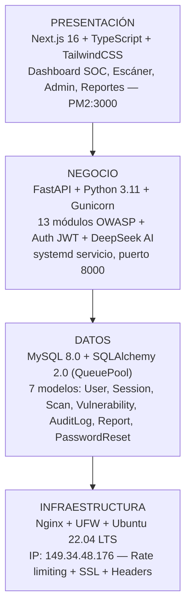

**UNIVERSIDAD PRIVADA DE TACNA**

**FACULTAD DE INGENIERÍA**

**Escuela Profesional de Ingeniería de Sistemas**

**Proyecto: Analizador de Vulnerabilidades Web — VulnScan Pro**

Curso: *Calidad y Pruebas de Software*

Docente: *Ing. Patrick Jose Cuadros Quiroga*

Integrantes:

**Ramos Loza, Mariela Estefany (2023077478)**

**Calloticona Chambilla, Marymar D. (2023076791)**

**Tacna – Perú**

**2026**

---

**Sistema: Analizador de Vulnerabilidades Web — VulnScan Pro**

**Informe de Visión**

Versión 1.1

| CONTROL DE VERSIONES | | | | | |
|:---:|:---|:---|:---|:---|:---|
| Versión | Hecha por | Revisada por | Aprobada por | Fecha | Motivo |
| 1.0 | M. Calloticona | M. Ramos | | 28/03/2026 | Versión Original |
| 1.1 | M. Ramos | M. Calloticona | | 04/04/2026 | Ampliación de stakeholders y requerimientos |

---

## ÍNDICE GENERAL

[1. Introducción](#1-introducción)

[2. Posicionamiento](#2-posicionamiento)

[3. Descripción de los interesados (Stakeholders) y usuarios](#3-descripción-de-los-interesados-stakeholders-y-usuarios)

[4. Vista General del Producto](#4-vista-general-del-producto)

[5. Características del Producto](#5-características-del-producto)

[6. Restricciones](#6-restricciones)

[7. Rangos de Calidad](#7-rangos-de-calidad)

[8. Precedencia y Prioridad](#8-precedencia-y-prioridad)

[9. Otros Requerimientos del Producto](#9-otros-requerimientos-del-producto)

[Conclusiones](#conclusiones)

[Recomendaciones](#recomendaciones)

[Bibliografía](#bibliografía)

---

## Informe de Visión

---

## 1. Introducción

### 1.1. Propósito

El presente documento de Visión define el problema que resuelve **VulnScan Pro — Analizador de Vulnerabilidades Web**, describe las características y capacidades del producto desde la perspectiva de sus partes interesadas (stakeholders), y establece el marco de referencia para el desarrollo del sistema. Este documento sirve como guía maestra para todos los involucrados en el proyecto, garantizando que el equipo de desarrollo, el docente supervisor y los usuarios finales compartan una comprensión común del alcance y los objetivos del sistema.

### 1.2. Alcance

VulnScan Pro es una plataforma web de análisis dinámico de seguridad de aplicaciones (DAST — Dynamic Application Security Testing) desarrollada como proyecto académico en el curso de Calidad y Pruebas de Software de la Escuela Profesional de Ingeniería de Sistemas de la Universidad Privada de Tacna (UPT), durante el semestre 2026-I.

El sistema permite identificar, clasificar y remediar vulnerabilidades de seguridad en aplicaciones web mediante un motor de escaneo automatizado que cubre el OWASP Top 10:2021, potenciado por inteligencia artificial (DeepSeek AI). La plataforma opera como una aplicación web accesible desde cualquier navegador, desplegada en un VPS Linux de producción (IP: 149.34.48.176).

**Dentro del alcance:** Motor DAST con 13 módulos OWASP, autenticación JWT multi-rol, integración DeepSeek AI, reportes exportables, dashboard SOC, panel administrativo, auditoría de accesos, despliegue en VPS Linux con Nginx + systemd + PM2.

**Fuera del alcance:** Análisis estático de código fuente (SAST), pruebas de infraestructura de red, análisis de aplicaciones móviles, pruebas de APIs GraphQL, integración CI/CD, soporte multi-tenant.

### 1.3. Definiciones, Acrónimos y Abreviaturas

| **Término** | **Definición** |
|:-----------|:---------------|
| DAST | Dynamic Application Security Testing — pruebas de seguridad en aplicación en ejecución |
| OWASP | Open Web Application Security Project — fundación global de seguridad web |
| OWASP Top 10 | Lista de las 10 vulnerabilidades web más críticas según OWASP (versión 2021) |
| XSS | Cross-Site Scripting — inyección de código JavaScript malicioso en páginas web |
| SQLi | SQL Injection — inyección de código SQL malicioso en bases de datos |
| CSRF | Cross-Site Request Forgery — falsificación de solicitudes entre sitios |
| SSRF | Server-Side Request Forgery — falsificación de solicitudes del lado del servidor |
| LFI | Local File Inclusion — inclusión de archivos locales del servidor |
| JWT | JSON Web Token — estándar abierto para tokens de autenticación seguros |
| CVSS | Common Vulnerability Scoring System — sistema estándar de puntuación de vulnerabilidades |
| CWE | Common Weakness Enumeration — enumeración estándar de debilidades de software |
| VPS | Virtual Private Server — servidor virtual privado de producción |
| SOC | Security Operations Center — centro de operaciones de seguridad |
| FastAPI | Framework Python moderno para APIs REST asíncronas |
| Next.js | Framework React con SSR para aplicaciones web |
| RBAC | Role-Based Access Control — control de acceso basado en roles |
| EPIS | Escuela Profesional de Ingeniería de Sistemas (UPT) |
| UPT | Universidad Privada de Tacna |

### 1.4. Referencias

- OWASP Top 10:2021. https://owasp.org/Top10/
- CVSS v3.1 Specification. https://www.first.org/cvss/specification-document
- ISO/IEC 25010:2011 — Systems and software Quality Requirements and Evaluation (SQuaRE)
- Ley N° 30096 — Ley de Delitos Informáticos (Perú)
- Ley N° 29733 — Ley de Protección de Datos Personales (Perú)

---

## 2. Posicionamiento

### 2.1. Oportunidad de Negocio

La seguridad de las aplicaciones web es una de las mayores preocupaciones del desarrollo de software moderno. Las herramientas de auditoría disponibles tienen precios que las hacen inaccesibles para estudiantes universitarios, desarrolladores independientes y PYMES de regiones como Tacna:

- **Burp Suite Professional:** USD 449/año (S/. 1,706)
- **Nessus Professional:** USD 3,590/año (S/. 13,642)
- **Acunetix:** USD 4,500/año (S/. 17,100)
- **Qualys WAS:** USD 2,995/año (S/. 11,381)

VulnScan Pro capitaliza esta brecha ofreciendo capacidades DAST equivalentes de forma gratuita, en español, con análisis de IA contextualizado.

### 2.2. Definición del Problema

| | |
|:--|:--|
| **El problema de:** | La falta de herramientas de auditoría de seguridad web accesibles, gratuitas y en español |
| **Que afecta a:** | Estudiantes de ingeniería, desarrolladores independientes, equipos QA, PYMES de Tacna |
| **El impacto del cual es:** | Aplicaciones web con vulnerabilidades conocidas (SQLi, XSS, CSRF) en producción, expuestas a ataques automatizados |
| **Una solución exitosa sería:** | Una plataforma web DAST gratuita, multi-módulo OWASP, con análisis IA y reportes exportables |

### 2.3. Definición de la Posición del Producto

| | |
|:--|:--|
| **Para:** | Estudiantes, desarrolladores, equipos QA y PYMES de Tacna y Perú |
| **Que:** | Necesitan identificar vulnerabilidades de seguridad en sus aplicaciones web |
| **El producto:** | VulnScan Pro — Analizador de Vulnerabilidades Web |
| **Que:** | Es una plataforma DAST con 13 módulos OWASP, análisis IA, reportes PDF/HTML/JSON y dashboard SOC |
| **A diferencia de:** | Burp Suite Pro, Nessus, Acunetix — costosos, en inglés, sin análisis IA contextualizado |
| **Nuestro producto:** | Es gratuito, open source, en español, con código de remediación por stack y accesible sin instalación |

---

## 3. Descripción de los Interesados (Stakeholders) y Usuarios

### 3.1. Resumen de los Interesados

| **Nombre** | **Descripción** | **Responsabilidad** |
|:-----------|:----------------|:-------------------|
| Ing. Patrick Jose Cuadros Quiroga | Docente del curso Calidad y Pruebas de Software, EPIS — UPT | Supervisar el desarrollo, evaluar la calidad técnica y documental del sistema |
| Calloticona Chambilla, Marymar D. | Co-desarrolladora — backend, motor de escaneo, DevOps | Diseñar e implementar la API FastAPI, motor de escaneo, JWT, DeepSeek AI y deploy en VPS |
| Ramos Loza, Mariela Estefany | Co-desarrolladora — frontend, QA, reportes | Diseñar e implementar el dashboard Next.js, pruebas de usuario y generación de reportes |
| Dirección EPIS — UPT | Entidad académica supervisora | Validar cumplimiento de estándares académicos EPIS |
| Estudiantes EPIS (UPT) | Usuarios finales académicos | Usar la plataforma para auditar sus proyectos de desarrollo web |
| PYMES y desarrolladores de Tacna | Beneficiarios externos | Usar la plataforma para diagnosticar seguridad de sus aplicaciones |

### 3.2. Resumen de los Usuarios

| **Nombre** | **Descripción** | **Rol en el Sistema** |
|:-----------|:----------------|:---------------------|
| Administrador | Control total de la plataforma | Gestión de usuarios, audit logs, todos los escaneos, configuración |
| Analista de Seguridad | Usuario profesional intermedio | Escaneos avanzados con IA, configuración de stack, exportar reportes |
| Usuario Regular | Usuario básico | Escaneos simples, ver resultados, exportar reportes básicos |

### 3.3. Entorno de Usuario

Los usuarios acceden mediante un navegador web estándar (Chrome 120+, Firefox 120+, Edge 120+) sin instalación de software. Flujo típico:

1. **Acceso** → navega a `http://149.34.48.176`
2. **Autenticación** → registro o login con email/contraseña
3. **Escaneo** → ingresa URL objetivo, configura profundidad y stack tecnológico
4. **Monitoreo** → el dashboard actualiza el estado cada 3 segundos (polling)
5. **Resultados** → visualiza vulnerabilidades con severidad, PoC, solución y análisis IA
6. **Exportación** → descarga reporte en PDF, HTML o JSON

### 3.4. Necesidades de los Interesados y Usuarios

| **Necesidad** | **Prioridad** | **Solución Propuesta** |
|:--------------|:-------------:|:----------------------|
| Identificar vulnerabilidades web automáticamente | Alta | Motor DAST con 13 módulos OWASP en paralelo |
| Entender el impacto real de cada vulnerabilidad | Alta | Análisis DeepSeek AI con escenario de ataque y código de remediación |
| Reportes formales para auditoría académica | Alta | Exportación PDF/HTML/JSON con diseño profesional |
| Gestionar múltiples escaneos y usuarios | Media | Panel admin con RBAC: Admin/Analista/Usuario |
| Monitorear estado de escaneo en tiempo real | Media | Dashboard SOC con polling 3s y gráficos Chart.js |
| Proteger acceso a resultados de vulnerabilidades | Alta | JWT + bcrypt + bloqueo anti-brute force + sesiones revocables |

---

## 4. Vista General del Producto

### 4.1. Perspectiva del Producto

VulnScan Pro opera como aplicación web independiente de tres capas sobre un VPS Linux:

### 4.2. Resumen de Capacidades

| **Beneficio** | **Característica de soporte** |
|:-------------|:------------------------------|
| Detección OWASP Top 10 automatizada | 13 módulos especializados e independientes |
| Análisis IA por vulnerabilidad | DeepSeek AI con fallback local |
| Reportes exportables profesionales | PDF (WeasyPrint), HTML, JSON |
| Dashboard SOC en tiempo real | Chart.js, polling 3s, contadores animados |
| Control de acceso granular | JWT + RBAC Admin/Analista/Usuario |
| Protección anti-brute force | Bloqueo 15 min tras 5 intentos fallidos |
| Auditoría completa | AuditLog con IP, user-agent, timestamp |
| Despliegue automatizado | deploy.sh — un solo comando |

### 4.3. Suposiciones y Dependencias

- El usuario posee autorización legal sobre las aplicaciones que escanea.
- DeepSeek AI API disponible para el análisis inteligente (fallback implementado si no está disponible).
- VPS Ubuntu 22.04 LTS activo con conectividad continua.

---

## 5. Características del Producto

### 5.1. Motor de Escaneo Multimódulo OWASP Top 10

**CRQ-01** — 13 módulos especializados:

| **#** | **Módulo** | **Vulnerabilidades** | **CWE** | **OWASP 2021** |
|:-----:|:-----------|:--------------------|:--------|:---------------|
| 1 | SQL Injection | Error-based, Blind Boolean, UNION-based | CWE-89 | A03 |
| 2 | Cross-Site Scripting | XSS reflejado, DOM-based | CWE-79 | A03 |
| 3 | CSRF | Ausencia token CSRF, SameSite inseguro | CWE-352 | A01 |
| 4 | SSRF | Redirección a recursos internos | CWE-918 | A10 |
| 5 | LFI / Path Traversal | `../etc/passwd`, directory traversal | CWE-22 | A01 |
| 6 | Command Injection | Inyección de comandos OS | CWE-78 | A03 |
| 7 | Open Redirect | Redirecciones a URLs externas | CWE-601 | A01 |
| 8 | Security Headers | Ausencia de CSP, HSTS, X-Frame-Options | CWE-693 | A05 |
| 9 | SSL/TLS | Versiones obsoletas, cipher débiles | CWE-326 | A02 |
| 10 | Sensitive Files | .env, .git, phpinfo.php, backup expuestos | CWE-538 | A01 |
| 11 | HTTP Methods | PUT, DELETE, TRACE habilitados | CWE-650 | A05 |
| 12 | Error Disclosure | Stack traces, mensajes de error internos | CWE-209 | A05 |
| 13 | Web Crawling | Descubrimiento de URLs con formularios | CWE-200 | A01 |

### 5.2. Inteligencia Artificial DeepSeek

**CRQ-02** — Para cada vulnerabilidad detectada genera:
- Puntuación CVSS v3.1 (0.0 – 10.0) + vector CVSS
- Identificador CWE
- Escenario de ataque realista con payload específico para el stack objetivo
- Código de remediación para: PHP, Python/Django, Node.js/Express, Java/Spring, Ruby on Rails, ASP.NET Core
- Risk Score global (0-100) con nivel de riesgo Crítico/Alto/Medio/Bajo
- Probabilidad de falso positivo (0-100%)

### 5.3. Autenticación y Control de Acceso (RBAC)

**CRQ-03:**
- JWT HS256, 24h, JTI único por sesión
- RBAC 3 roles: Admin / Analista / Usuario
- Bloqueo automático 15 min tras 5 intentos fallidos
- Sesiones revocables remotamente
- Recuperación de contraseña con token 1h

### 5.4. Dashboard SOC en Tiempo Real

**CRQ-04:**
- Contadores: total escaneos, vulnerabilidades críticas, sitios analizados, risk score promedio
- Gráfico de dona: distribución por severidad (Crítica/Alta/Media/Baja/Informativa)
- Gráfico de línea temporal: evolución de vulnerabilidades en los últimos 7 días
- Lista de últimos escaneos con estado y resultados

### 5.5. Escáner Interactivo Configurable

**CRQ-05:**
- Selección de profundidad: Básico / Estándar / Completo
- Selección de stack tecnológico para personalizar payloads y análisis IA
- Timeout configurable: 5 / 10 / 30 / 60 segundos
- Polling automático de estado cada 3 segundos
- Resultados parciales en tiempo real

### 5.6. Visualización de Resultados

**CRQ-06:**
- Badges de severidad codificados por color
- Vista detallada: descripción técnica, URL afectada, PoC, solución, referencias OWASP/CVE/CWE
- Pestaña de análisis IA: escenario de ataque, código de remediación, CVSS, CWE
- Filtros por severidad, módulo y estado de remediación
- Risk score global con gauge visual (0-100)

### 5.7. Generación de Reportes Multi-formato

**CRQ-07:**
- **PDF** (WeasyPrint): portada, tabla de vulnerabilidades, análisis IA, remediaciones priorizadas
- **HTML navegable:** reporte interactivo con tabla de contenidos
- **JSON estructurado:** para integración CI/CD

### 5.8. Panel de Administración

**CRQ-08:**
- Gestión de usuarios (crear/editar/bloquear/eliminar)
- Vista de todos los escaneos de todos los usuarios
- Audit log completo paginado con filtros
- Estadísticas globales del sistema

### 5.9. Historial y Gestión de Escaneos

**CRQ-09:**
- Lista paginada de escaneos con búsqueda por URL
- Filtros por estado y rango de fechas
- Comparación entre escaneos del mismo objetivo (delta de vulnerabilidades)

### 5.10. Auditoría y Trazabilidad

**CRQ-10:**
- Registro inmutable de: login, logout, escaneos, exportaciones, cambios de usuario
- Incluye: user_id, action, ip_address, user_agent, endpoint, status_code, timestamp
- Exportación CSV/JSON para auditorías formales

### 5.11. Gestión de Perfil de Usuario

**CRQ-11:**
- Edición de datos personales
- Cambio de contraseña con verificación
- Ver y cerrar sesiones activas en todos los dispositivos

### 5.12. Seguridad Interna de la Plataforma

**CRQ-12:**
- HTTPS forzado en producción (Nginx)
- Headers de seguridad en todas las respuestas
- Rate limiting en 3 capas: Nginx / API global / Login
- Variables sensibles en `.env` con `.gitignore`
- bcrypt cost ≥ 10, SQL parametrizado con ORM, validación Pydantic

---

## 6. Restricciones

| **#** | **Restricción** | **Tipo** | **Descripción** |
|:-----:|:----------------|:--------:|:----------------|
| RES-01 | Uso autorizado únicamente | Legal/Ética | Aviso legal obligatorio antes de escanear; uso indebido es responsabilidad del usuario |
| RES-02 | Sin escaneos destructivos | Técnica | Los módulos son de solo lectura; no modifican datos del objetivo |
| RES-03 | Un escaneo activo por usuario | Técnica | Máximo 1 escaneo simultáneo por usuario para proteger recursos del VPS |
| RES-04 | Timeout máximo 60 s por módulo | Técnica | Configurable 5-60 s para evitar bloqueos por objetivos lentos |
| RES-05 | Objetivo HTTP/HTTPS únicamente | Técnica | Solo URLs web; sin IPs privadas (192.168.x.x, 10.x.x.x) |
| RES-06 | Backend Python 3.11+ | Técnica | Incompatible con Python ≤ 3.9 |
| RES-07 | Despliegue solo en Linux | Técnica | deploy.sh y systemd requieren Ubuntu 22.04 LTS |
| RES-08 | Resultados orientativos | Técnica | No reemplaza auditoría de seguridad profesional manual |

---

## 7. Rangos de Calidad

Evaluación según ISO/IEC 25010:2011:

| **Característica** | **Sub-característica** | **Métrica** | **Valor objetivo** |
|:-------------------|:----------------------|:------------|:-----------------:|
| Funcionalidad | Completitud funcional | % módulos OWASP implementados | 100% (13/13) |
| Funcionalidad | Corrección | % vulnerabilidades detectadas en sitio test | ≥ 85% |
| Rendimiento | Tiempo de respuesta | Inicio de escaneo desde click | < 2 s |
| Rendimiento | Capacidad | Escaneos simultáneos | ≥ 10 |
| Usabilidad | Aprendizaje | Tiempo hasta primer escaneo sin tutorial | < 5 min |
| Usabilidad | Operabilidad | Clics para escaneo básico | ≤ 3 |
| Confiabilidad | Disponibilidad | Uptime mensual | ≥ 99.5% |
| Confiabilidad | Tolerancia a fallos | Recuperación automática tras caída | < 5 s |
| Confiabilidad | Exactitud | Tasa de falsos positivos por módulo | < 15% |
| Seguridad | Autenticidad | Mecanismo de autenticación | JWT + bcrypt ≥ 10 |
| Seguridad | No repudio | Audit log de acciones | 100% |
| Mantenibilidad | Modularidad | LOC por módulo de escaneo | < 100 |
| Portabilidad | Adaptabilidad | Instalación en VPS limpio | 1 comando |

---

## 8. Precedencia y Prioridad

Modelo MoSCoW:

| **Prioridad** | **Características** |
|:-------------:|:--------------------|
| **Must Have** | Motor de escaneo (13 módulos), Auth JWT, Dashboard SOC, Visualización resultados, PDF |
| **Should Have** | Análisis IA, Historial escaneos, Panel admin, Rate limiting, Audit logs |
| **Could Have** | Comparación escaneos, Sesiones remotas, JSON/HTML export, CSV audit log |
| **Won't Have** | SAST, API pública/webhooks, CI/CD, apps móviles, multi-tenant |

---

## 9. Otros Requerimientos del Producto

### 9.1. Estándares Aplicables

- OWASP Top 10:2021 — categorías de vulnerabilidades detectadas
- OWASP Testing Guide v4.2 — metodología por módulo de escaneo
- CVSS v3.1 — puntuación de vulnerabilidades por el módulo IA
- CWE — enumeración de debilidades por vulnerabilidad
- ISO/IEC 25010:2011 — modelo de calidad para evaluación del sistema
- RFC 7519 — estándar JWT implementado para autenticación
- Ley N° 30096 (Perú) — Ley de Delitos Informáticos
- Ley N° 29733 (Perú) — Ley de Protección de Datos Personales

### 9.2. Requerimientos del Sistema

| **Componente** | **Mínimo** | **Recomendado** |
|:---------------|:----------:|:---------------:|
| Servidor | 1 vCPU, 2 GB RAM, Ubuntu 22.04 | 2 vCPU, 4 GB RAM, Ubuntu 22.04 |
| Almacenamiento | 20 GB SSD | 50 GB SSD |
| Navegador cliente | Chrome 120+ / Firefox 120+ | Chrome 125+ |

### 9.3. Requerimientos de Rendimiento

- Inicio de escaneo (POST `/scans`) < 500 ms
- Polling de estado (GET `/scans/{id}`) < 200 ms
- Generación de reporte PDF < 10 s (hasta 50 vulnerabilidades)
- Dashboard carga < 3 s en conexión de 10 Mbps
- MySQL: QueuePool pool_size=10, max_overflow=20, 20 conexiones simultáneas

---

## Conclusiones

1. VulnScan Pro responde a una necesidad real en el ecosistema académico y de PYMES de Tacna: acceso gratuito a diagnósticos de seguridad web de nivel profesional, en español, potenciados por IA.

2. El sistema ofrece propuesta de valor diferenciada frente a herramientas comerciales: costo cero, resultados en español, análisis IA con código de remediación por stack tecnológico, reportes PDF y dashboard SOC en tiempo real.

3. La arquitectura desacoplada (FastAPI + MySQL + Next.js) y el stack 100% open source garantizan la sostenibilidad y reproducibilidad del proyecto.

4. El modelo de calidad ISO/IEC 25010 asegura evaluación objetiva en funcionalidad, rendimiento, usabilidad, confiabilidad, seguridad y mantenibilidad.

---

## Recomendaciones

1. Extender los módulos de escaneo a la OWASP API Security Top 10 en versiones futuras.
2. Implementar notificaciones por email/webhook al completar un escaneo.
3. Publicar la experiencia como caso de estudio en la revista EPIS-UPT.
4. Considerar integración CI/CD (GitHub Actions) para escaneo automático en cada despliegue.

---

## Bibliografía

- OWASP Foundation (2021). *OWASP Top Ten*. https://owasp.org/Top10/
- ISO/IEC (2011). *ISO/IEC 25010:2011 — SQuaRE*. International Standards Organization.
- FIRST.org (2019). *CVSS v3.1 Specification Document*.
- Ramírez, S. (2023). *FastAPI documentation*. https://fastapi.tiangolo.com/
- Vercel Inc. (2024). *Next.js 16 Documentation*. https://nextjs.org/docs
- DeepSeek AI (2024). *DeepSeek API Reference*. https://platform.deepseek.com/api-docs
- Congreso de la República del Perú (2013). *Ley N° 30096 — Ley de Delitos Informáticos*.
- Congreso de la República del Perú (2011). *Ley N° 29733 — Ley de Protección de Datos Personales*.

---

*Documento elaborado por: Calloticona Chambilla, Marymar D. y Ramos Loza, Mariela Estefany*
*Curso: Calidad y Pruebas de Software — Docente: Ing. Patrick Jose Cuadros Quiroga — UPT — 2026*
