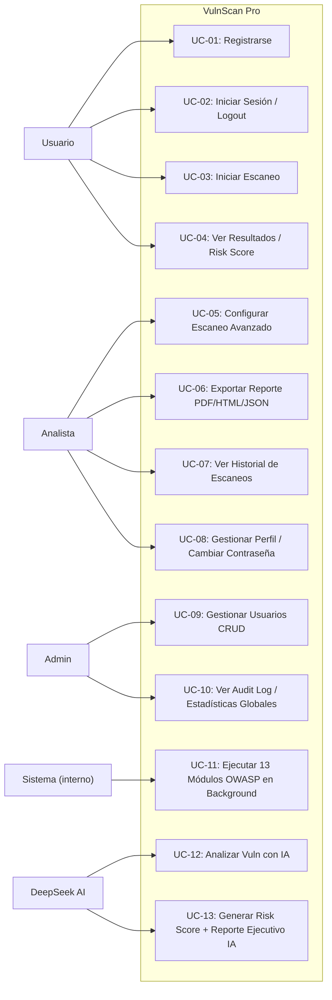
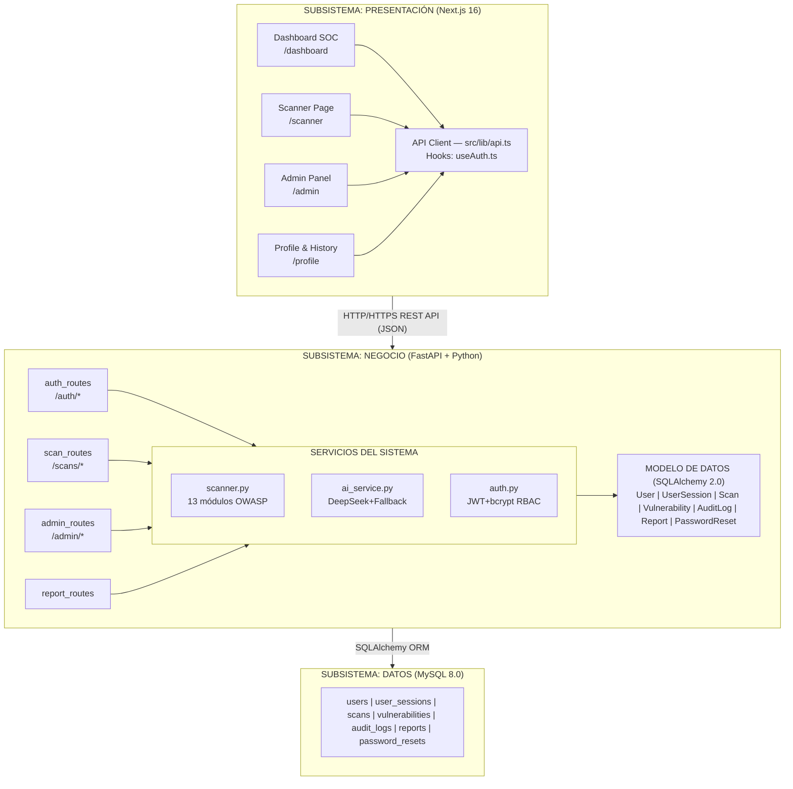
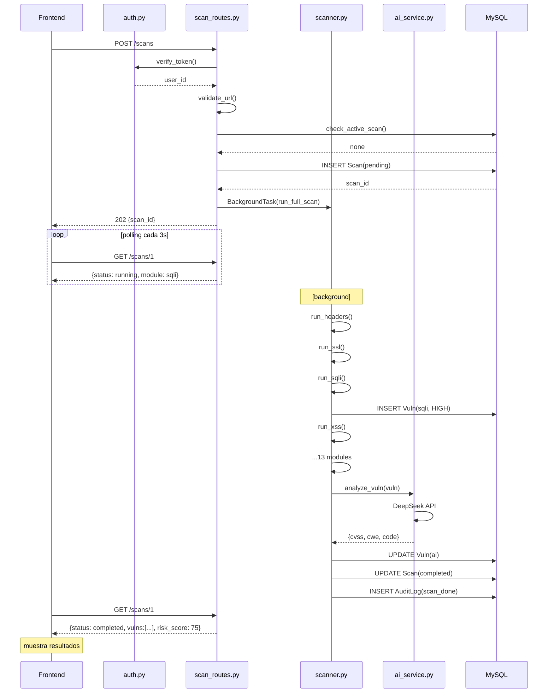
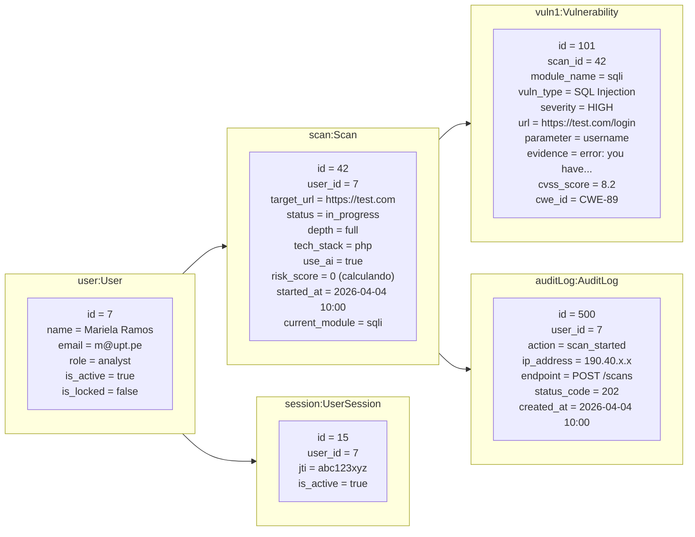
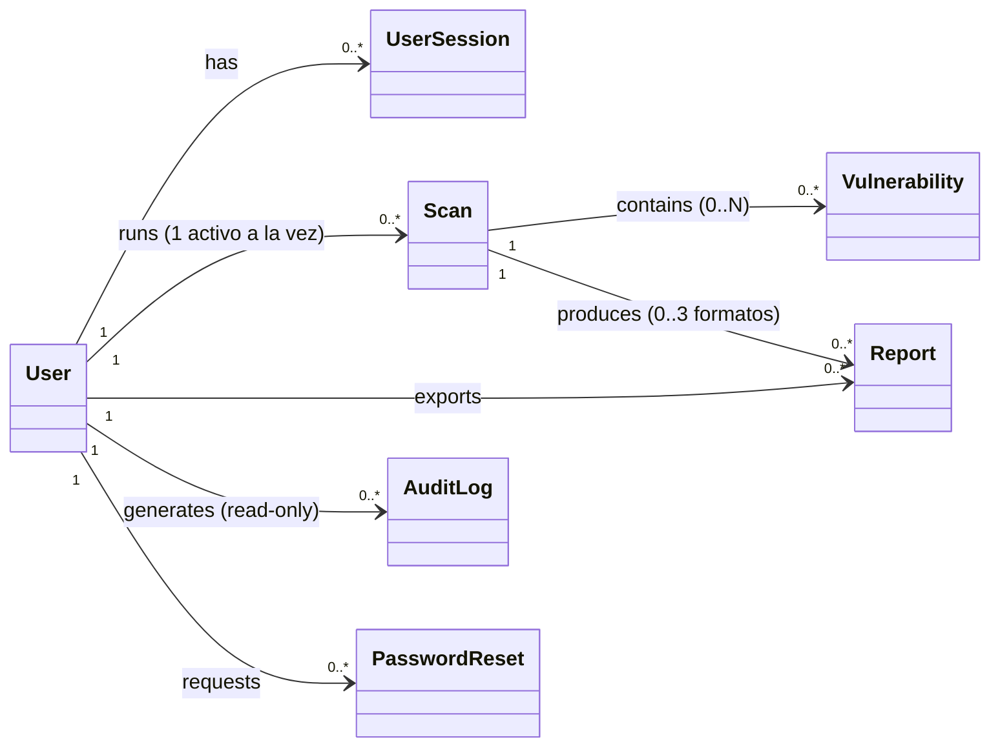
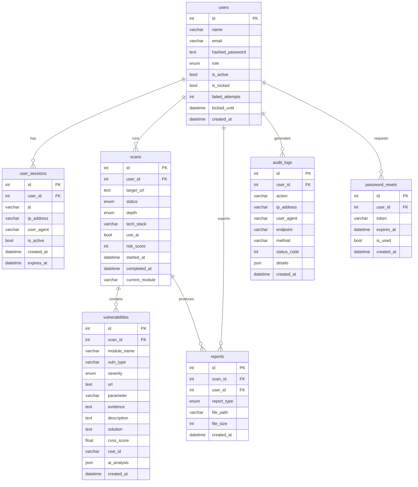
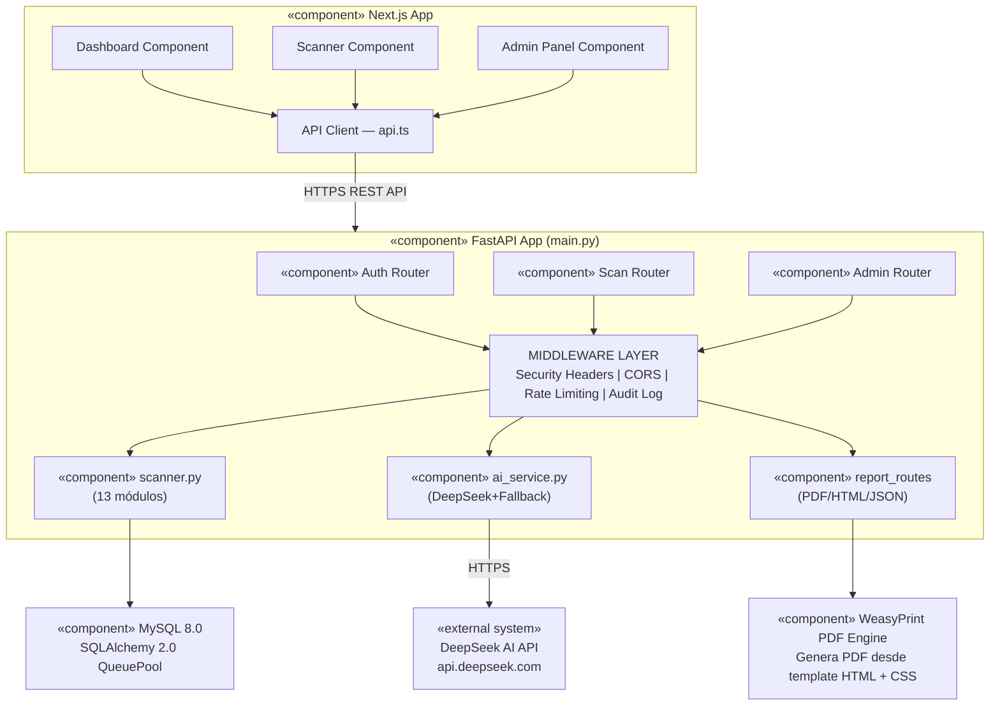
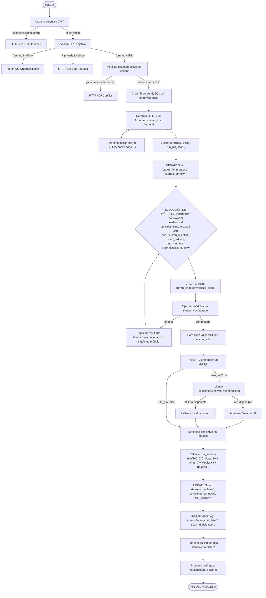
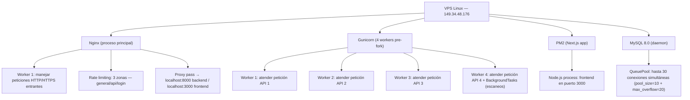
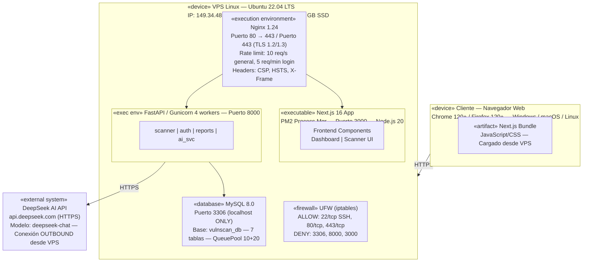

<center>


**UNIVERSIDAD PRIVADA DE TACNA**

**FACULTAD DE INGENIERÍA**

**Escuela Profesional de Ingeniería de Sistemas**

**Proyecto: Analizador de Vulnerabilidades Web — VulnScan Pro**

Curso: *Calidad y Pruebas de Software*

Docente: *Ing. Patrick Jose Cuadros Quiroga*

Integrantes:

**Ramos Loza, Mariela Estefany (2023077478)**

**Calloticona Chambilla, Marymar D. (2023076791)**

**Tacna – Perú**

**2026**

</center>

<div style="page-break-after: always;"></div>

---

**Sistema: Analizador de Vulnerabilidades Web — VulnScan Pro**

**Documento de Arquitectura de Software**

Versión 1.1

| CONTROL DE VERSIONES | | | | | |
|:---:|:---|:---|:---|:---|:---|
| Versión | Hecha por | Revisada por | Aprobada por | Fecha | Motivo |
| 1.0 | M. Calloticona | M. Ramos | | 28/03/2026 | Versión Original |
| 1.1 | M. Ramos | M. Calloticona | | 04/04/2026 | Actualización vistas 4+1, atributos calidad |

<div style="page-break-after: always;"></div>

---

## ÍNDICE GENERAL

[1. INTRODUCCIÓN](#1-introducción)

&nbsp;&nbsp;&nbsp;&nbsp;[1.1 Propósito (Diagrama 4+1)](#11-propósito-diagrama-41)

&nbsp;&nbsp;&nbsp;&nbsp;[1.2 Alcance](#12-alcance)

&nbsp;&nbsp;&nbsp;&nbsp;[1.3 Definición, Siglas y Abreviaturas](#13-definición-siglas-y-abreviaturas)

&nbsp;&nbsp;&nbsp;&nbsp;[1.4 Organización del Documento](#14-organización-del-documento)

[2. OBJETIVOS Y RESTRICCIONES ARQUITECTÓNICAS](#2-objetivos-y-restricciones-arquitectónicas)

&nbsp;&nbsp;&nbsp;&nbsp;[2.1.1 Requerimientos Funcionales](#211-requerimientos-funcionales)

&nbsp;&nbsp;&nbsp;&nbsp;[2.1.2 Requerimientos No Funcionales — Atributos de Calidad](#212-requerimientos-no-funcionales--atributos-de-calidad)

&nbsp;&nbsp;&nbsp;&nbsp;[Restricciones](#restricciones)

[3. REPRESENTACIÓN DE LA ARQUITECTURA DEL SISTEMA](#3-representación-de-la-arquitectura-del-sistema)

&nbsp;&nbsp;&nbsp;&nbsp;[3.1 Vista de Caso de Uso](#31-vista-de-caso-de-uso)

&nbsp;&nbsp;&nbsp;&nbsp;[3.2 Vista Lógica](#32-vista-lógica)

&nbsp;&nbsp;&nbsp;&nbsp;[3.3 Vista de Implementación](#33-vista-de-implementación)

&nbsp;&nbsp;&nbsp;&nbsp;[3.4 Vista de Procesos](#34-vista-de-procesos)

&nbsp;&nbsp;&nbsp;&nbsp;[3.5 Vista de Despliegue](#35-vista-de-despliegue)

[4. ATRIBUTOS DE CALIDAD DEL SOFTWARE](#4-atributos-de-calidad-del-software)

<div style="page-break-after: always;"></div>

---

## 1. INTRODUCCIÓN

### 1.1 Propósito (Diagrama 4+1)

El presente documento describe la arquitectura de software del sistema **VulnScan Pro — Analizador de Vulnerabilidades Web** utilizando el modelo de vistas 4+1 (Kruchten, 1995). Este enfoque permite describir el sistema desde cinco perspectivas complementarias que satisfacen los intereses de los distintos stakeholders:

| **Vista** | **Perspectiva** | **Stakeholder principal** |
|:----------|:----------------|:--------------------------|
| **Caso de Uso** | Funcionalidades del sistema y sus actores | Docente evaluador, usuarios finales |
| **Lógica** | Estructura interna del software (clases, módulos, paquetes) | Equipo de desarrollo |
| **Implementación** | Organización del código fuente y componentes | Equipo de desarrollo, DevOps |
| **Procesos** | Comportamiento en tiempo de ejecución, concurrencia | Equipo de desarrollo, operaciones |
| **Despliegue** | Distribución física del sistema en infraestructura | DevOps, administración de sistemas |

El documento establece la visión global de la arquitectura de VulnScan Pro, justifica las decisiones de diseño arquitectónico clave (separación frontend/backend, motor de escaneo asíncrono, integración IA, modelo de seguridad en capas) y documenta las influencias de los requerimientos funcionales y no funcionales sobre la estructura del sistema.

**Decisiones arquitectónicas principales:**
- **Separación de responsabilidades:** Backend FastAPI (Python) completamente desacoplado del frontend Next.js. Comunicación exclusivamente por API REST (JSON sobre HTTP/HTTPS).
- **Escaneo asíncrono:** El motor de escaneo usa `BackgroundTasks` de FastAPI para ejecutar los 13 módulos OWASP sin bloquear el servidor ni la interfaz de usuario.
- **Seguridad en capas:** Rate limiting en Nginx → API → endpoint de login; JWT en la capa de autenticación; bcrypt para contraseñas; headers de seguridad en middleware; UFW en la capa de red.
- **IA con fallback:** Integración con DeepSeek AI API con mecanismo de fallback local que garantiza funcionalidad sin dependencia de la red externa.

### 1.2 Alcance

La arquitectura descrita en este documento abarca la totalidad del sistema VulnScan Pro en su versión 1.1 (2026-I), incluyendo:

- **Backend:** API REST con FastAPI, motor de escaneo de 13 módulos OWASP, autenticación JWT, integración DeepSeek AI, generación de reportes PDF/HTML/JSON.
- **Frontend:** Dashboard SOC, escáner interactivo, panel de administración, historial de escaneos (Next.js 16 + TypeScript + TailwindCSS).
- **Base de datos:** 7 modelos relacionales en MySQL 8.0 (User, UserSession, Scan, Vulnerability, AuditLog, Report, PasswordReset).
- **Infraestructura:** VPS Linux Ubuntu 22.04 LTS (IP: 149.34.48.176), Nginx proxy reverso, systemd, PM2, UFW.

No se incluye la arquitectura de los sistemas externos (DeepSeek AI API, servicios DNS del VPS).

### 1.3 Definición, Siglas y Abreviaturas

| **Término** | **Definición** |
|:-----------|:---------------|
| 4+1 | Modelo de vistas de arquitectura de software de Philippe Kruchten (1995) |
| DAST | Dynamic Application Security Testing — pruebas dinámicas de seguridad |
| FastAPI | Framework Python asíncrono para APIs REST basado en ASGI/Uvicorn |
| ASGI | Asynchronous Server Gateway Interface — interfaz de servidor Python asíncrono |
| WSGI | Web Server Gateway Interface — interfaz de servidor Python síncrono |
| Next.js | Framework React con SSR, App Router y optimizaciones de producción |
| SSR | Server-Side Rendering — renderizado del lado del servidor |
| JWT | JSON Web Token — tokens de autenticación firmados digitalmente |
| JTI | JWT ID — identificador único de un token JWT, previene replay attacks |
| ORM | Object-Relational Mapping — mapeo objeto-relacional (SQLAlchemy 2.0) |
| QueuePool | Implementación de pool de conexiones de SQLAlchemy |
| BackgroundTasks | Mecanismo de FastAPI para ejecutar tareas asíncronas sin bloquear el servidor |
| Gunicorn | Servidor WSGI pre-fork de Python para producción |
| PM2 | Process Manager 2 — gestor de procesos Node.js con auto-restart |
| systemd | Sistema de inicialización y gestor de servicios de Linux |
| UFW | Uncomplicated Firewall — interfaz de iptables para Linux |
| Nginx | Servidor web y proxy reverso de alto rendimiento |
| VPS | Virtual Private Server — servidor virtual privado |
| CVSS | Common Vulnerability Scoring System — puntuación estándar de vulnerabilidades |
| CWE | Common Weakness Enumeration — enumeración de debilidades de software |
| OWASP | Open Web Application Security Project |
| RBAC | Role-Based Access Control — control de acceso basado en roles |
| CSP | Content-Security-Policy — header de seguridad HTTP |
| HSTS | HTTP Strict Transport Security — header de seguridad HTTP |
| DeepSeek | Modelo de lenguaje IA usado para el análisis de vulnerabilidades |
| WeasyPrint | Librería Python para generar PDFs desde HTML/CSS |
| bcrypt | Función de hash de contraseñas con salt y cost factor configurable |
| HS256 | HMAC-SHA256 — algoritmo de firma de JWT |

### 1.4 Organización del Documento

El documento está organizado siguiendo la estructura del modelo 4+1:

- **Sección 2:** Objetivos arquitectónicos — requerimientos funcionales y no funcionales priorizados; restricciones de diseño.
- **Sección 3:** Las 5 vistas de arquitectura: Caso de Uso (3.1), Lógica (3.2), Implementación (3.3), Procesos (3.4), Despliegue (3.5).
- **Sección 4:** Atributos de calidad del software con escenarios concretos (Funcionalidad, Usabilidad, Confiabilidad, Rendimiento, Mantenibilidad, Otros).

<div style="page-break-after: always;"></div>

---

## 2. OBJETIVOS Y RESTRICCIONES ARQUITECTÓNICAS

Las decisiones arquitectónicas de VulnScan Pro están guiadas por la priorización de sus requerimientos funcionales y no funcionales, y por las restricciones del proyecto.

### 2.1.1 Requerimientos Funcionales

Los requerimientos funcionales que tienen mayor impacto sobre las decisiones de arquitectura se priorizan en la siguiente tabla:

| **ID** | **Descripción** | **Prioridad** |
|:------:|:----------------|:-------------:|
| RF-17 | Iniciar escaneo de vulnerabilidades con URL objetivo | Alta |
| RF-24 | Ejecutar escaneo en background (BackgroundTasks) sin bloquear la interfaz | Alta |
| RF-25 | Módulo SQL Injection: error-based, boolean-based, UNION-based | Alta |
| RF-26 | Módulo XSS: reflejado y DOM-based en parámetros GET y formularios | Alta |
| RF-27 | Módulo CSRF: tokens CSRF y SameSite en cookies | Alta |
| RF-32 | Módulo Security Headers: CSP, HSTS, X-Frame-Options, X-Content-Type-Options | Alta |
| RF-33 | Módulo SSL/TLS: versiones deprecadas y cipher débiles | Alta |
| RF-34 | Módulo Sensitive Files: .env, .git, phpinfo.php y 17+ rutas adicionales | Alta |
| RF-38 | Calcular risk score global (0-100) basado en severidad de vulnerabilidades | Alta |
| RF-43 | Enviar vulnerabilidades a DeepSeek AI para CVSS, CWE, escenario de ataque y código de remediación | Alta |
| RF-46 | Fallback local de análisis IA cuando DeepSeek no está disponible | Alta |
| RF-48 | Generar reportes PDF con WeasyPrint: portada, tabla de vulns, análisis IA, risk score | Alta |
| RF-02 | Autenticar usuarios con JWT (HS256, 24h, JTI único) | Alta |
| RF-03 | Bloquear cuenta tras 5 intentos fallidos por 15 minutos | Alta |
| RF-53 | Dashboard con contadores y gráficos Chart.js en tiempo real | Media |
| RF-58 | Polling del estado del escaneo cada 3 segundos | Alta |
| RF-59 | Panel de administración: lista de todos los usuarios con filtros | Alta |
| RF-62 | Audit log de todas las acciones del sistema | Alta |
| RF-01 | Registrar usuarios con bcrypt (cost ≥ 10) | Alta |
| RF-06 | Crear usuarios con roles Admin/Analista/Usuario | Alta |

### 2.1.2 Requerimientos No Funcionales — Atributos de Calidad

| **ID** | **Descripción** | **Prioridad** |
|:------:|:----------------|:-------------:|
| RNF-01 | Contraseñas hasheadas con bcrypt (cost ≥ 10) | Alta |
| RNF-02 | Inicio de escaneo < 2 s desde el clic | Alta |
| RNF-03 | Soporte ≥ 10 escaneos simultáneos | Alta |
| RNF-04 | Primer escaneo exitoso en < 5 min para usuario sin experiencia | Alta |
| RNF-05 | Uptime mensual ≥ 99.5% | Alta |
| RNF-06 | Recuperación automática ante fallos en < 5 s | Alta |
| RNF-07 | JWT con expiración 24h y JTI único | Alta |
| RNF-08 | Rate limiting en 3 capas: Nginx + API + Login | Alta |
| RNF-09 | 100% de acciones de auth y gestión de escaneos en audit log | Alta |
| RNF-10 | Módulos de escaneo independientes para mantenimiento aislado | Media |
| RNF-11 | Despliegue en VPS Ubuntu 22.04 con un solo script (deploy.sh) | Media |
| RNF-13 | HTTPS forzado en producción (TLS 1.2+) | Alta |
| RNF-15 | SQL parametrizado con ORM — sin concatenación de strings SQL | Alta |
| RNF-17 | Headers de seguridad HTTP en todas las respuestas | Alta |
| RNF-19 | MySQL QueuePool: pool_size=10, max_overflow=20 | Media |
| RNF-22 | Timeouts configurables (5-60 s) por módulo de escaneo | Alta |
| RNF-26 | Servicio systemd con NoNewPrivileges=yes, PrivateTmp=yes | Alta |
| RNF-27 | UFW: solo puertos 22, 80, 443 accesibles desde internet | Alta |
| RNF-28 | MySQL solo desde localhost (puerto 3306 no expuesto) | Alta |
| RNF-30 | Validación de entrada con Pydantic en todos los endpoints | Alta |

### Restricciones

| **#** | **Restricción** | **Tipo** | **Impacto arquitectónico** |
|:-----:|:----------------|:--------:|:--------------------------|
| RSTR-01 | El sistema debe funcionar en un VPS Linux Ubuntu 22.04 LTS de 2 vCPU / 4 GB RAM | Infraestructura | Limita la concurrencia máxima; justifica BackgroundTasks sobre threading múltiple |
| RSTR-02 | El backend debe ser Python 3.11+ con FastAPI | Técnica | Justifica el uso de async/await y Pydantic v2 |
| RSTR-03 | El frontend debe ser Next.js 16 con App Router | Técnica | Justifica el uso de React Server Components y edge rendering |
| RSTR-04 | La base de datos debe ser MySQL 8.0 (sin cambio a PostgreSQL) | Técnica | Requiere PyMySQL como driver; QueuePool para gestión de conexiones |
| RSTR-05 | El proyecto es académico con inversión efectiva ≤ S/. 200 | Económica | Stack 100% open source; DeepSeek free tier; VPS económico S/. 18/mes |
| RSTR-06 | El sistema no puede almacenar credenciales en el repositorio de código | Seguridad | Variables de entorno en .env excluido con .gitignore |
| RSTR-07 | Un escaneo activo por usuario (protección de recursos del VPS) | Negocio | Requiere gestión de estado de escaneo en base de datos |
| RSTR-08 | Desarrollo en 4 semanas por 2 desarrolladoras | Tiempo | Justifica el uso de frameworks de alto nivel y librerías de terceros |

<div style="page-break-after: always;"></div>

---

## 3. REPRESENTACIÓN DE LA ARQUITECTURA DEL SISTEMA

### 3.1 Vista de Caso de Uso

La vista de caso de uso describe las funcionalidades del sistema desde la perspectiva de los actores externos e internos. Sirve como la vista central del modelo 4+1, alrededor de la cual se organizan las demás vistas.

#### 3.1.1 Diagramas de Casos de Uso

**Actores:**

| **Actor** | **Tipo** | **Descripción** |
|:----------|:--------:|:----------------|
| Usuario | Principal externo | Usuario autenticado con rol "usuario". Acceso básico al sistema. |
| Analista | Principal externo | Usuario con rol "analista". Extiende Usuario con configuración avanzada. |
| Administrador | Principal externo | Usuario con rol "admin". Control total del sistema. |
| Sistema | Interno | Ejecuta escaneos en background, audita acciones, gestiona timeouts. |
| DeepSeek AI | Externo (servicio) | API externa de IA para análisis de vulnerabilidades. |

**Diagrama de Casos de Uso — Vista Global:**



**Casos de uso arquitectónicamente significativos** (los que más impactan la arquitectura):

| **UC** | **Nombre** | **Relevancia arquitectónica** |
|:------:|:-----------|:------------------------------|
| UC-03 | Iniciar Escaneo | Define el patrón asíncrono: BackgroundTasks + polling desde frontend. El más complejo del sistema. |
| UC-11 | Ejecutar 13 Módulos OWASP | Define la modularidad del motor de escaneo y el manejo de timeouts. |
| UC-12 | Analizar con IA | Define la integración externa con DeepSeek y el patrón de fallback. |
| UC-02 | Iniciar Sesión | Define el modelo de seguridad: JWT + bcrypt + anti-brute force + audit log. |
| UC-06 | Exportar Reporte | Define la generación de documentos en múltiples formatos (PDF/HTML/JSON). |

<div style="page-break-after: always;"></div>

### 3.2 Vista Lógica

La vista lógica describe la estructura interna del sistema: sus subsistemas, paquetes y cómo se comunican para satisfacer los requerimientos funcionales.

#### 3.2.1 Diagrama de Subsistemas (Paquetes)



#### 3.2.2 Diagrama de Secuencia (Vista de Diseño)

**Escenario: Escaneo completo con análisis IA**



#### 3.2.3 Diagrama de Colaboración (Vista de Diseño)

Los objetos que colaboran en el caso de uso UC-03 "Iniciar Escaneo":

```mermaid
graph TD
    FE["Frontend\nScanner Page"] -- "POST /scans" --> SR["scan_routes.py"]
    SR -- "202 scan_id" --> FE
    FE -- "polling GET /scans/id" --> SR
    SR -- "verify JWT" --> AUTH["auth.py\nget_current_user()"]
    AUTH -- "user object" --> MYSQL["MySQL\nINSERT Scan"]
    MYSQL --> BG["Background Task"]
    BG --> SCANNER["scanner.py\nrun_full_scan()"]
    BG --> AISVC["ai_service.py\nDeepSeek"]
    SCANNER -- "analyzeVuln" --> AISVC
       │
       └──── GET cada 3s ──── status: in_progress → completed
```

#### 3.2.4 Diagrama de Objetos

Estado del sistema durante un escaneo activo:



#### 3.2.5 Diagrama de Clases

(Ver diagrama completo en FD03 — Sección V.3.d)

Los 7 modelos SQLAlchemy y sus relaciones clave:



#### 3.2.6 Diagrama de Base de Datos (Relacional)



<div style="page-break-after: always;"></div>

### 3.3 Vista de Implementación (Vista de Desarrollo)

La vista de implementación describe la organización física del código fuente en el repositorio.

#### 3.3.1 Diagrama de Arquitectura Software (Paquetes)

```
vulnerabilidad/                         ← Raíz del repositorio
│
├── backend/                            ← Subsistema Backend (FastAPI)
│   ├── main.py                         ← Entrypoint: lifespan, CORS, middleware, routers
│   ├── database.py                     ← Conexión MySQL: create_engine, QueuePool, SessionLocal
│   ├── models.py                       ← 7 modelos SQLAlchemy: User, Session, Scan, Vuln, etc.
│   ├── auth.py                         ← JWT: create/verify token, get_current_user, require_role
│   ├── scanner.py                      ← Motor de escaneo: 13 funciones módulo + run_full_scan()
│   ├── ai_service.py                   ← DeepSeek API client + AIService + fallback local
│   ├── solutions_routes.py             ← Endpoints de soluciones y análisis IA
│   ├── requirements.txt                ← Dependencias Python (FastAPI, SQLAlchemy, WeasyPrint...)
│   ├── .env.example                    ← Template de variables de entorno (sin secretos)
│   └── routes/
│       ├── auth_routes.py              ← /auth/register, /auth/login, /auth/logout, /auth/me
│       ├── scan_routes.py              ← /scans (POST), /scans/{id} (GET), polling endpoint
│       ├── admin_routes.py             ← /admin/users, /admin/scans, /admin/audit-logs
│       └── report_routes.py           ← /reports/{scan_id}/pdf, /html, /json
│
├── frontend/                           ← Subsistema Frontend (Next.js 16)
│   ├── package.json                    ← Dependencias Node.js
│   ├── next.config.js                  ← Configuración Next.js (rewrites API proxy)
│   ├── tailwind.config.js              ← Configuración TailwindCSS
│   └── src/
│       ├── lib/
│       │   └── api.ts                  ← Cliente API centralizado + tipos TypeScript
│       ├── hooks/
│       │   └── useAuth.ts              ← Hook: estado de auth, login, logout
│       ├── components/
│       │   ├── Navbar.tsx              ← Navegación con RBAC (oculta ítems por rol)
│       │   └── SeverityBadge.tsx       ← Componentes reutilizables de severidad
│       └── app/                        ← App Router (Next.js 16)
│           ├── page.tsx                ← Landing page / redirect a dashboard
│           ├── login/page.tsx          ← Formulario de login
│           ├── register/page.tsx       ← Formulario de registro
│           ├── dashboard/page.tsx      ← Dashboard SOC: stats, gráficos, últimos escaneos
│           ├── scanner/
│           │   ├── page.tsx            ← Formulario de escaneo
│           │   └── [id]/page.tsx       ← Detalle de escaneo / resultados
│           ├── admin/page.tsx          ← Panel de administración (solo Admin)
│           └── profile/page.tsx        ← Perfil de usuario
│
├── nginx.conf                          ← Configuración Nginx: proxy + rate limiting + headers
├── vulnscan-backend.service            ← Unidad systemd: Gunicorn 4 workers + seguridad
├── deploy.sh                           ← Script de despliegue automatizado (one-command)
├── media/
│   └── logo-upt.png                    ← Logo UPT para documentación
├── .gitignore                          ← Excluye: .env, venv_win/, __pycache__/, .next/
└── FD0{1,2,3,4}-*.md                  ← Documentación académica EPIS
```

#### 3.3.2 Diagrama de Arquitectura del Sistema (Diagrama de Componentes)



<div style="page-break-after: always;"></div>

### 3.4 Vista de Procesos

La vista de procesos describe el comportamiento del sistema en tiempo de ejecución, cómo los procesos y threads se coordinan para ejecutar las funcionalidades del sistema.

#### 3.4.1 Diagrama de Procesos del Sistema (Diagrama de Actividad)

**Proceso principal: Ciclo de vida completo de un escaneo DAST**



**Procesos del sistema en producción (concurrencia):**



<div style="page-break-after: always;"></div>

### 3.5 Vista de Despliegue (Vista Física)

La vista de despliegue muestra la distribución física del sistema sobre los nodos de infraestructura.

#### 3.5.1 Diagrama de Despliegue



<div style="page-break-after: always;"></div>

---

## 4. ATRIBUTOS DE CALIDAD DEL SOFTWARE

Los atributos de calidad (QAs — Quality Attributes) son propiedades medibles y evaluables del sistema VulnScan Pro que indican el grado en que satisface las necesidades de sus stakeholders. Se describen como escenarios concretos siguiendo el modelo ISO/IEC 25010:2011.

---

### Escenario de Funcionalidad

La funcionalidad se califica de acuerdo con el conjunto de características y capacidades del programa, la generalidad de las funciones entregadas y la seguridad general del sistema.

**Escenario F-01: Detección de SQL Injection**

| **Atributo** | **Valor** |
|:------------|:----------|
| **Fuente** | Usuario Analista ejecuta escaneo completo contra `https://aplicacion-vulnerable.com/login` |
| **Estímulo** | Solicitud de escaneo con módulo SQLi habilitado y stack PHP seleccionado |
| **Entorno** | Sistema en funcionamiento normal en producción |
| **Artefacto** | Módulo `run_sql_injection_scan()` en `scanner.py` |
| **Respuesta** | El sistema prueba 6 payloads SQLi (error-based, boolean-based, UNION-based) en todos los parámetros GET y campos de formulario encontrados. Si alguna respuesta contiene indicadores de SQLi (errores MySQL, diferencias booleanas), clasifica la vulnerabilidad como ALTA con evidencia del payload que funcionó. |
| **Medida de respuesta** | Al menos el 85% de vulnerabilidades SQLi reales en sitios de prueba son detectadas. Tasa de falsos positivos < 15%. |

**Escenario F-02: Análisis IA completo**

| **Atributo** | **Valor** |
|:------------|:----------|
| **Fuente** | Sistema (automático) al detectar vulnerabilidad crítica (SQLi HIGH) |
| **Estímulo** | Vulnerabilidad Vulnerability(type="SQLi", severity="HIGH", stack="php") lista para análisis |
| **Entorno** | DeepSeek API disponible y con créditos |
| **Artefacto** | `ai_service.py` — método `analyze_vulnerability()` |
| **Respuesta** | El sistema construye un prompt contextualizado con los datos de la vulnerabilidad y el stack. DeepSeek retorna en JSON: cvss_score=8.2, cvss_vector="AV:N/AC:L/PR:N/UI:N/S:U/C:H/I:H/A:N", cwe="CWE-89", escenario de ataque específico para PHP/MySQL, código de remediación con prepared statements en PHP PDO. |
| **Medida de respuesta** | Respuesta de IA recibida en < 5 segundos. CVSS score presente en 100% de los análisis. Código de remediación en el lenguaje del stack seleccionado en ≥ 90% de los casos. |

**Escenario F-03: Generación de reporte PDF**

| **Atributo** | **Valor** |
|:------------|:----------|
| **Fuente** | Usuario hace clic en "Exportar PDF" desde el detalle del escaneo |
| **Estímulo** | GET `/reports/{scan_id}/pdf` con JWT válido |
| **Entorno** | Escaneo con 15 vulnerabilidades (3 críticas, 7 altas, 5 medias), análisis IA habilitado |
| **Artefacto** | `report_routes.py` + WeasyPrint |
| **Respuesta** | El sistema genera un PDF con: portada (logo UPT, metadatos), índice, tabla resumen de vulnerabilidades, descripción técnica de cada vulnerabilidad, análisis IA (CVSS, escenario, código de remediación), risk score visual y sección de recomendaciones. |
| **Medida de respuesta** | PDF generado en < 10 segundos. Archivo descargado directamente en el navegador con nombre `vulnscan_report_{scan_id}_{fecha}.pdf`. |

---

### Escenario de Usabilidad

La usabilidad se refiere a la facilidad con la que un usuario puede aprender a utilizar e interpretar los resultados producidos por el sistema (Barbacci, 1995).

**Escenario U-01: Primer escaneo de un usuario nuevo**

| **Atributo** | **Valor** |
|:------------|:----------|
| **Fuente** | Estudiante de la EPIS-UPT sin experiencia en herramientas de seguridad |
| **Estímulo** | Primera vez usando VulnScan Pro. Quiere escanear su proyecto académico. |
| **Entorno** | Sistema en producción; usuario accede desde Chrome 125 en laptop universitaria |
| **Artefacto** | Interfaz de usuario Next.js: registro + página de escaneo |
| **Respuesta** | El usuario completa el registro (formulario simple: nombre, email, contraseña). Navega al escáner. Ingresa la URL de su proyecto. Hace clic en "Iniciar Escaneo Básico". El dashboard muestra el progreso en tiempo real. Al completarse, ve los resultados con badges de color (rojo=crítico, naranja=alto) y puede leer la descripción de cada vulnerabilidad en español. |
| **Medida de respuesta** | El usuario completa su primer escaneo exitoso en < 5 minutos desde que abre el navegador. No requiere leer documentación. |

**Escenario U-02: Interpretación de resultados por desarrollador no especialista**

| **Atributo** | **Valor** |
|:------------|:----------|
| **Fuente** | Desarrollador PHP sin conocimientos de seguridad |
| **Estímulo** | Su escaneo detectó una vulnerabilidad SQL Injection ALTA |
| **Entorno** | Vista de detalle del escaneo completado |
| **Artefacto** | Componente de visualización de vulnerabilidades + pestaña de análisis IA |
| **Respuesta** | El sistema muestra: nombre de la vulnerabilidad en español ("Inyección SQL"), descripción clara del riesgo, la URL y parámetro exactos donde fue detectada, y en la pestaña IA: un escenario de ataque explicando cómo un atacante podría explotar esto, y código PHP con PDO preparado statements para solucionar el problema. El desarrollador puede copiar el código de remediación directamente. |
| **Medida de respuesta** | El desarrollador puede entender el riesgo y copiar el código de solución en < 2 minutos sin recurrir a búsquedas externas. |

**Escenario U-03: Acceso rápido a funciones frecuentes**

| **Atributo** | **Valor** |
|:------------|:----------|
| **Fuente** | Analista de seguridad que usa VulnScan Pro diariamente |
| **Estímulo** | Quiere iniciar un nuevo escaneo avanzado desde el dashboard |
| **Entorno** | Sesión activa en el dashboard |
| **Artefacto** | Navbar con links directos + botón "Nuevo Escaneo" en dashboard |
| **Respuesta** | El analista hace 1 clic en "Nuevo Escaneo" (botón prominente en el dashboard), configura la URL + stack en el formulario, y hace clic en "Iniciar". |
| **Medida de respuesta** | Flujo completo: ≤ 3 clics desde el dashboard hasta que el escaneo está en progreso. |

---

### Escenario de Confiabilidad

La confiabilidad equilibra confidencialidad, integridad y disponibilidad. La seguridad de un sistema se caracteriza por mecanismos que reducen el impacto de ataques y amenazas.

**Escenario C-01: Recuperación automática tras fallo del servicio backend**

| **Atributo** | **Valor** |
|:------------|:----------|
| **Fuente** | Error interno en el servidor (crash de proceso Gunicorn) |
| **Estímulo** | El proceso Gunicorn termina inesperadamente (SIGSEGV o OutOfMemory) |
| **Entorno** | Producción, durante horas de uso activo |
| **Artefacto** | Unidad systemd `vulnscan-backend.service` con `Restart=always, RestartSec=5` |
| **Respuesta** | systemd detecta el fallo y reinicia el servicio Gunicorn automáticamente en 5 segundos. Los escaneos activos en el momento del fallo se marcan como "failed" en la base de datos. Los usuarios reciben errores 503 temporales durante el reinicio. |
| **Medida de respuesta** | Servicio restaurado en < 5 segundos. Uptime mensual ≥ 99.5%. |

**Escenario C-02: Protección contra ataques de fuerza bruta**

| **Atributo** | **Valor** |
|:------------|:----------|
| **Fuente** | Atacante externo realizando ataque de fuerza bruta contra el endpoint de login |
| **Estímulo** | 5 intentos de login fallidos consecutivos para la cuenta `admin@vulnscan.com` en < 1 minuto |
| **Entorno** | Producción, acceso desde IP 203.x.x.x |
| **Artefacto** | `auth_routes.py` — lógica de bloqueo en endpoint POST /auth/login |
| **Respuesta** | Al 5to intento fallido: `is_locked=True`, `locked_until=now()+15min`. Los siguientes intentos retornan HTTP 423 "Cuenta bloqueada. Intente de nuevo en X minutos". Se registra en AuditLog con IP y user-agent del atacante. Nginx rate limiting (5 req/min) limita también la velocidad del ataque. |
| **Medida de respuesta** | La cuenta queda bloqueada automáticamente. El atacante no puede probar más de 5 contraseñas por sesión de 15 minutos. AuditLog registra 100% de los intentos. |

**Escenario C-03: Integridad del audit log**

| **Atributo** | **Valor** |
|:------------|:----------|
| **Fuente** | Administrador del sistema |
| **Estímulo** | Intento de eliminar o modificar un registro del audit log mediante la API |
| **Entorno** | Panel de administración → Audit Log |
| **Artefacto** | `admin_routes.py` — endpoints de audit log |
| **Respuesta** | El sistema solo expone endpoints GET (lectura) para el audit log. No existen endpoints DELETE, PUT ni PATCH para la tabla `audit_logs`. Intentos de acceso a endpoints no existentes retornan HTTP 404/405. |
| **Medida de respuesta** | 0 registros de audit log pueden ser modificados o eliminados por ningún actor del sistema. Integridad garantizada a nivel de arquitectura (ausencia de endpoints de modificación). |

---

### Escenario de Rendimiento

El rendimiento se mide con base en la velocidad de procesamiento, el tiempo de respuesta, el uso de recursos, el conjunto y la eficiencia (Pressman 2010, pág. 187).

**Escenario R-01: Inicio de escaneo bajo carga**

| **Atributo** | **Valor** |
|:------------|:----------|
| **Fuente** | 10 usuarios simultáneos inician escaneos al mismo tiempo |
| **Estímulo** | 10 peticiones POST `/scans` simultáneas con JWT válidos distintos |
| **Entorno** | VPS de producción (2 vCPU, 4 GB RAM), Gunicorn 4 workers |
| **Artefacto** | `scan_routes.py` + MySQL QueuePool + BackgroundTasks |
| **Respuesta** | El sistema crea los 10 escaneos en la base de datos y retorna HTTP 202 con el scan_id para cada uno. Los escaneos se ejecutan en cola. Los 4 primeros comienzan inmediatamente; los siguientes esperan disponibilidad de workers. No hay degradación en el tiempo de respuesta del endpoint. |
| **Medida de respuesta** | Tiempo de respuesta del POST /scans < 2 segundos bajo carga de 10 usuarios simultáneos. MySQL QueuePool maneja el pool sin superar el límite de 30 conexiones. |

**Escenario R-02: Polling de estado del escaneo**

| **Atributo** | **Valor** |
|:------------|:----------|
| **Fuente** | Frontend del usuario con escaneo en progreso |
| **Estímulo** | Petición GET `/scans/{id}` cada 3 segundos desde el navegador |
| **Entorno** | Escaneo activo, sistema en producción |
| **Artefacto** | `scan_routes.py` — endpoint GET /scans/{id} |
| **Respuesta** | El endpoint lee el estado actual del escaneo de MySQL (status, current_module, vulnerabilidades parciales) y retorna JSON. La operación es una lectura simple con índice en scan_id. |
| **Medida de respuesta** | Tiempo de respuesta < 200 ms para el 95% de las peticiones de polling. Sin impacto perceptible en el rendimiento de otros usuarios. |

**Escenario R-03: Generación de reporte PDF**

| **Atributo** | **Valor** |
|:------------|:----------|
| **Fuente** | Analista solicita exportación de reporte PDF |
| **Estímulo** | GET `/reports/{scan_id}/pdf` para escaneo con 30 vulnerabilidades y análisis IA |
| **Entorno** | Sistema en producción |
| **Artefacto** | `report_routes.py` + WeasyPrint |
| **Respuesta** | El sistema consulta todas las vulnerabilidades del escaneo, renderiza el template HTML con los datos y genera el PDF con WeasyPrint. El archivo se retorna como stream de descarga directa. |
| **Medida de respuesta** | PDF generado en < 10 segundos para escaneos con hasta 50 vulnerabilidades. |

---

### Escenario de Mantenibilidad

La mantenibilidad combina la capacidad del programa para ser ampliable (extensibilidad), adaptable y servicial (Pressman 2010, pág. 187).

**Escenario M-01: Agregar nuevo módulo de escaneo**

| **Atributo** | **Valor** |
|:------------|:----------|
| **Fuente** | Desarrollador que quiere agregar un nuevo módulo (ej: CORS Misconfiguration) |
| **Estímulo** | Necesidad de detectar CORS permisivos (Access-Control-Allow-Origin: *) en APIs |
| **Entorno** | Desarrollo local con repositorio clonado |
| **Artefacto** | `scanner.py` + `scan_routes.py` |
| **Respuesta** | El desarrollador: (1) Agrega una función `run_cors_scan(target_url, timeout)` en `scanner.py` siguiendo el patrón de las 13 funciones existentes. (2) Agrega `"cors"` a la lista `MODULES` en `run_full_scan()`. Sin modificar ningún otro archivo. El nuevo módulo aparece automáticamente en los escaneos completos. |
| **Medida de respuesta** | Tiempo de implementación de un nuevo módulo básico: < 2 horas. Sin modificaciones a la arquitectura base. Sin downtime al desplegar el nuevo módulo. |

**Escenario M-02: Actualización del modelo IA**

| **Atributo** | **Valor** |
|:------------|:----------|
| **Fuente** | DeepSeek lanza nueva versión del modelo (`deepseek-chat-v2`) |
| **Estímulo** | Necesidad de actualizar el modelo usado en el análisis de vulnerabilidades |
| **Entorno** | Producción, sin interrumpir el servicio |
| **Artefacto** | `ai_service.py` — configuración del modelo |
| **Respuesta** | El desarrollador actualiza la constante `MODEL = "deepseek-chat-v2"` en `ai_service.py` y reinicia el servicio con `sudo systemctl restart vulnscan-backend`. El cambio no requiere modificaciones en la base de datos ni en el frontend. |
| **Medida de respuesta** | Cambio de modelo en < 5 minutos con downtime de reinicio del servicio < 5 segundos. |

**Escenario M-03: Depuración de falso positivo en módulo SQLi**

| **Atributo** | **Valor** |
|:------------|:----------|
| **Fuente** | Administrador reporta falsos positivos del módulo SQLi en aplicaciones Rails |
| **Estímulo** | El módulo SQLi genera falsos positivos con el framework Ruby on Rails que usa comillas simples en respuestas normales |
| **Entorno** | Desarrollo local |
| **Artefacto** | `scanner.py` — función `run_sql_injection_scan()` |
| **Respuesta** | El desarrollador identifica el patrón de respuesta de Rails que confunde al módulo, agrega una condición de exclusión específica para ese patrón. Solo `scanner.py` requiere modificación. Las pruebas del módulo aislado validan la corrección. |
| **Medida de respuesta** | El módulo es testeable de forma aislada sin ejecutar el sistema completo. Corrección e implementación en < 4 horas. |

---

### Otros Escenarios

**Escenario P-01: Performance bajo escaneos concurrentes**

El atributo de calidad Performance se refiere a la capacidad de respuesta del sistema, tanto el tiempo requerido para responder a eventos determinados como la cantidad de eventos procesados en un intervalo de tiempo dado.

| **Atributo** | **Valor** |
|:------------|:----------|
| **Fuente** | 5 usuarios ejecutando escaneos completos (13 módulos, 60s timeout) simultáneamente |
| **Estímulo** | 5 escaneos activos simultáneos en el VPS de producción (2 vCPU, 4 GB RAM) |
| **Entorno** | Producción, horario pico (20:00-22:00 hora Tacna) |
| **Artefacto** | Gunicorn (4 workers) + BackgroundTasks + MySQL QueuePool |
| **Respuesta** | Los 4 primeros escaneos se procesan en workers disponibles. El 5to escaneo ingresa a la cola de BackgroundTasks. El CPU no supera el 80% (2 vCPU). Los endpoints de la API (autenticación, polling, dashboard) siguen respondiendo con normalidad para los 5 usuarios simultáneos y otros usuarios que solo consultan resultados. |
| **Medida de respuesta** | Todos los escaneos completan en el tiempo esperado (+/- 20% del tiempo de escaneo base). La API de polling responde en < 500 ms durante la carga. Sin degradación para usuarios que no están escaneando. |

**Escenario S-01: Seguridad — Inyección SQL en la API de VulnScan**

| **Atributo** | **Valor** |
|:------------|:----------|
| **Fuente** | Atacante externo intentando inyectar SQL en los parámetros de la API de VulnScan |
| **Estímulo** | POST `/auth/login` con payload `{"email": "' OR 1=1--", "password": "x"}` |
| **Entorno** | Producción, VPS accesible desde internet |
| **Artefacto** | `auth_routes.py` → Pydantic validation → SQLAlchemy ORM |
| **Respuesta** | Pydantic valida el formato del email (rechaza el payload con HTTP 422 por formato inválido). Si el formato superara la validación, SQLAlchemy usa consultas parametrizadas (prepared statements) que no permiten inyección SQL. La contraseña del atacante no coincide con ningún hash bcrypt. La IP del atacante se registra en AuditLog. |
| **Medida de respuesta** | 0 vulnerabilidades SQLi en la propia API de VulnScan. Todos los endpoints validan entradas con Pydantic. Todas las consultas usan ORM parametrizado. |

---

*Documento elaborado por: Calloticona Chambilla, Marymar D. y Ramos Loza, Mariela Estefany*
*Curso: Calidad y Pruebas de Software — Docente: Ing. Patrick Jose Cuadros Quiroga — UPT — 2026*
