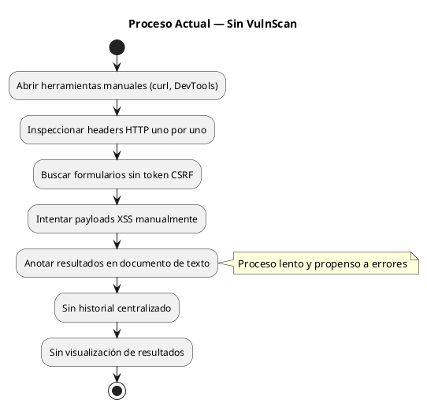
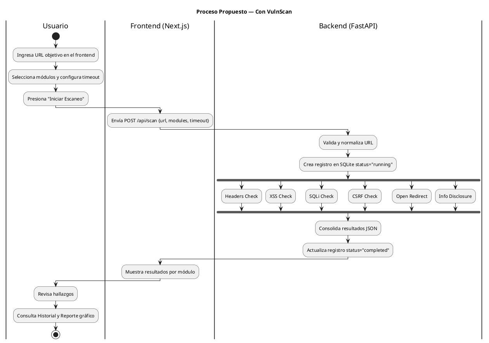
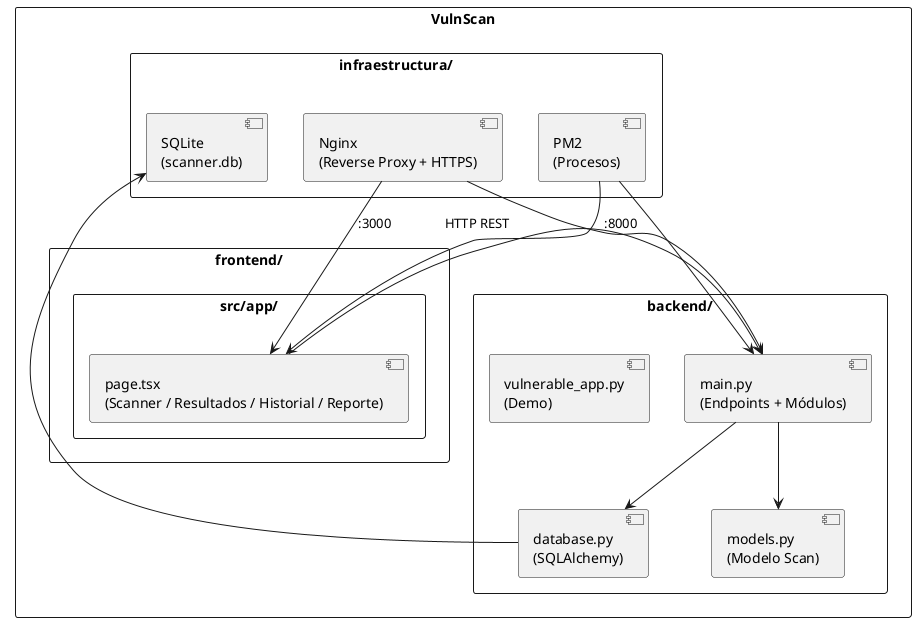
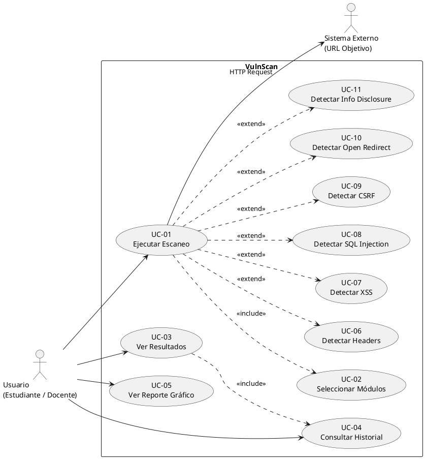
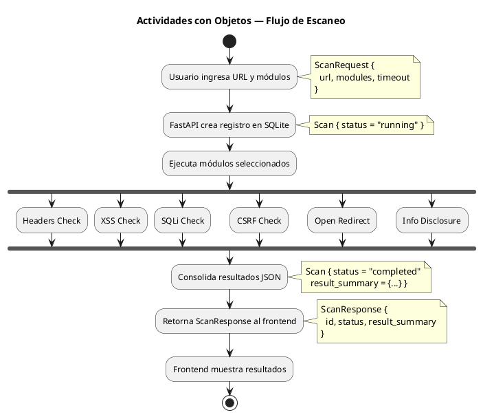
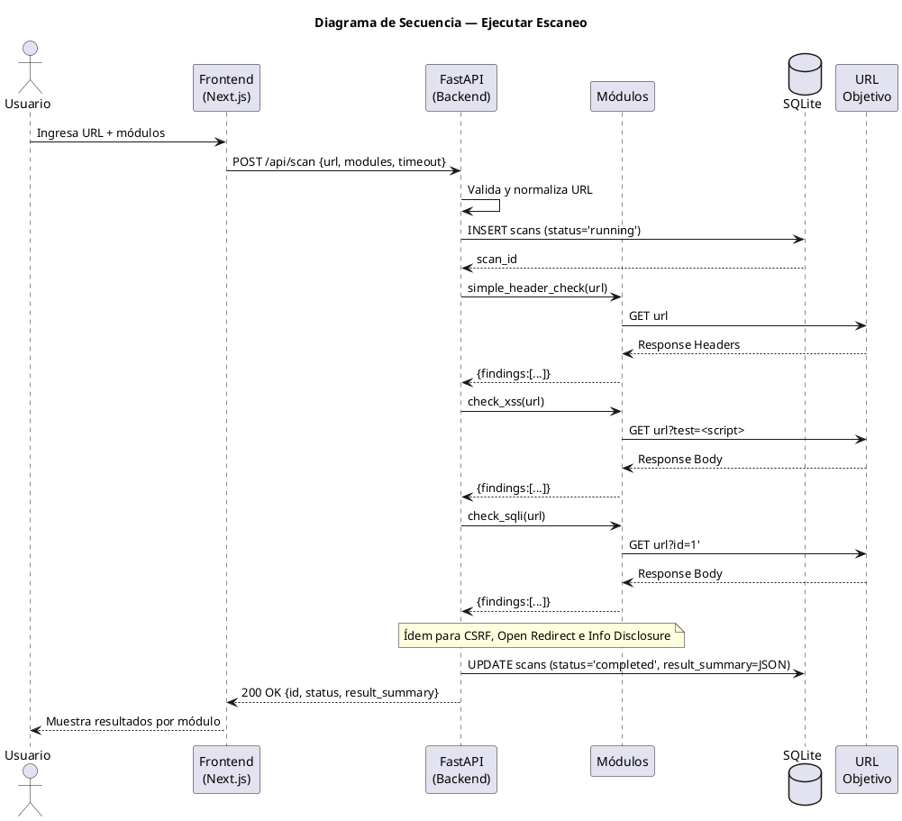
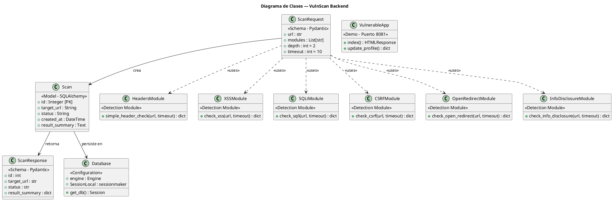

# UNIVERSIDAD PRIVADA DE TACNA
## FACULTAD DE INGENIERÍA
### Escuela Profesional de Ingeniería de Sistemas

---

# Proyecto: Escáner de Vulnerabilidades Web

**Curso:** Calidad y Pruebas de Software

**Docente:** Patrick Jose Cuadros Quiroga

**Integrantes:**
- Marymar Danytza Calloticona Chambilla — 2023076791
- Mariela Estefany Raos Loza — 2023077002

**Tacna — Perú**
**2026**

---

## CONTROL DE VERSIONES

| Versión | Hecha por | Revisada por | Aprobada por | Fecha | Motivo |
|:-------:|:---------:|:------------:|:------------:|:-----:|--------|
| 1.0 | M.C. / M.R. | P.C.Q. | P.C.Q. | 02/05/2026 | Versión Original |

---

**Sistema:** Escáner de Vulnerabilidades Web (VulnScan)

**Documento de Especificación de Requerimientos de Software**

**Versión 1.0**

---

## ÍNDICE GENERAL

1. [Introducción](#introducción)
2. [Generalidades del Proyecto](#i-generalidades-del-proyecto)
3. [Visionamiento del Sistema](#ii-visionamiento-del-sistema)
4. [Análisis de Procesos](#iii-análisis-de-procesos)
5. [Especificación de Requerimientos de Software](#iv-especificación-de-requerimientos-de-software)
6. [Fase de Desarrollo](#v-fase-de-desarrollo)
7. [Conclusiones](#conclusiones)
8. [Recomendaciones](#recomendaciones)
9. [Bibliografía](#bibliografía)
10. [Webgrafía](#webgrafía)

---

## INTRODUCCIÓN

El presente documento corresponde a la Especificación de Requerimientos de Software (ERS) del proyecto **VulnScan**, un escáner de vulnerabilidades web desarrollado como herramienta educativa en el marco del curso de Calidad y Pruebas de Software de la Universidad Privada de Tacna.

El sistema permite analizar aplicaciones web en busca de vulnerabilidades basadas en el **OWASP Top 10:2021**, proporcionando a estudiantes, docentes y desarrolladores una herramienta práctica para comprender y detectar los errores de seguridad más comunes en entornos web controlados.

El proyecto está compuesto por un backend desarrollado en **Python con FastAPI**, un frontend en **Next.js con TypeScript**, una base de datos **SQLite** para el historial de escaneos, y se encuentra desplegado en un servidor VPS con **HTTPS habilitado** mediante Nginx y gestionado con PM2.

---

## I. Generalidades del Proyecto

### 1. Nombre del Proyecto

**VulnScan — Escáner de Vulnerabilidades Web**

### 2. Visión

Ser una herramienta educativa de referencia para la enseñanza práctica de la seguridad web en entornos académicos, permitiendo a los estudiantes identificar, comprender y documentar vulnerabilidades reales basadas en estándares internacionales como OWASP.

### 3. Misión

Proporcionar una plataforma funcional, accesible y desplegada en producción que permita ejecutar escaneos de vulnerabilidades sobre aplicaciones web reales, registrar los resultados en un historial consultable y generar reportes visuales útiles para el aprendizaje y la evaluación.

### 4. Organigrama del Equipo

| Integrante | Rol Principal |
|------------|---------------|
| Marymar Danytza Calloticona Chambilla | Desarrollo Backend — FastAPI / Python |
| Mariela Estefany Raos Loza | Desarrollo Frontend — Next.js / TypeScript |

---

## II. Visionamiento del Sistema

### 1. Descripción del Problema

Las aplicaciones web modernas son vulnerables a una amplia variedad de ataques de seguridad. El OWASP Top 10:2021 documenta las diez categorías de vulnerabilidades más críticas y frecuentes. Sin embargo, la mayoría de herramientas profesionales de análisis de seguridad son costosas, complejas de configurar o requieren conocimientos avanzados, lo que dificulta su uso en contextos educativos.

Los estudiantes de ingeniería de sistemas carecen de una herramienta accesible, en español, desplegada y lista para usar, que les permita practicar la detección de vulnerabilidades web sobre objetivos reales o simulados de forma segura y controlada.

### 2. Objetivos de Negocio

- Proveer una herramienta gratuita y educativa para la detección de vulnerabilidades web.
- Facilitar la comprensión práctica del OWASP Top 10:2021 en el entorno académico.
- Registrar y visualizar el historial de escaneos realizados para análisis y evaluación.
- Demostrar la viabilidad de desplegar una aplicación full-stack completa en infraestructura real.

### 3. Objetivos de Diseño

- Diseñar una interfaz web intuitiva con pestañas diferenciadas: Scanner, Resultados, Historial y Reporte.
- Implementar una API REST documentada y consumible desde cualquier cliente HTTP.
- Garantizar que el sistema sea desplegable en un VPS con Nginx y HTTPS sin configuración manual compleja.
- Incluir una aplicación vulnerable de demostración para validar todas las detecciones del sistema.

### 4. Alcance del Proyecto

**Incluido:**
- Detección de 6 categorías de vulnerabilidades: Headers de seguridad, XSS reflejado, SQL Injection, CSRF, Open Redirect e Information Disclosure.
- Historial de escaneos almacenado en SQLite con visualización en dashboard.
- Aplicación vulnerable de demostración (`vulnerable_app.py`) para pruebas controladas.
- Despliegue en VPS con Nginx, PM2 y HTTPS habilitado.
- Documentación interactiva de la API en `/docs`.

**No incluido:**
- Detección de XSS DOM-based o almacenado.
- SQL Injection de tipo blind o time-based.
- Crawling automático de múltiples páginas.
- Autenticación de usuarios o gestión de sesiones.
- Análisis de aplicaciones que requieren login.

### 5. Viabilidad del Sistema

**Viabilidad Técnica:** El sistema utiliza tecnologías de código abierto ampliamente documentadas (FastAPI, Next.js, SQLite, Nginx). El equipo cuenta con los conocimientos necesarios para su desarrollo y despliegue.

**Viabilidad Operativa:** La herramienta está desplegada en un VPS con dominio NoIP y HTTPS, accesible desde cualquier navegador sin instalación adicional.

**Viabilidad Económica:** Las tecnologías utilizadas son gratuitas. El único costo es el servidor VPS (Elastika) y el dominio NoIP, ambos de bajo costo mensual.

### 6. Información Obtenida del Levantamiento de Información

Durante el desarrollo se realizaron escaneos sobre sitios reales para validar el funcionamiento del sistema:

| Sitio Escaneado | Hallazgos | Detalle Principal |
|-----------------|:---------:|-------------------|
| net.upt.edu.pe | 5 | PHP 5.5.33 desactualizado + 4 headers faltantes |
| portal.upt.edu.pe | 4 | Apache versión expuesta + PHP 8.2.29 visible |
| aulavirtual.upt.edu.pe | 4 | X-Powered-By: PHP/8.1.29 expuesto |
| cuevana3.st | 3 | CSRF detectado + headers faltantes |
| elastika.pe | 2 | Server header con información de versión |
| music.youtube.com | 0 | Sin hallazgos detectados |

*Figura 1: Hallazgos por sitio escaneado — datos reales de la base de datos VulnScan*

---

## III. Análisis de Procesos

### a) Diagrama del Proceso Actual — Diagrama de Actividades

El siguiente diagrama muestra el proceso manual que el usuario realizaba antes de contar con VulnScan. Es lento, propenso a errores humanos, no repetible de forma sistemática y no genera historial automático.

*Figura 2: Diagrama de actividades — Proceso actual sin VulnScan*

### b) Diagrama del Proceso Propuesto — Diagrama de Actividades

Con VulnScan el proceso se automatiza completamente. El usuario solo ingresa la URL y selecciona los módulos; el sistema ejecuta, guarda y visualiza todo de forma automática.

*Figura 3: Diagrama de actividades — Proceso propuesto con VulnScan*

---

## IV. Especificación de Requerimientos de Software

### a) Cuadro de Requerimientos Funcionales Inicial

| ID | Requerimiento | Prioridad |
|----|---------------|:---------:|
| RF-01 | El sistema debe permitir ingresar una URL como objetivo de escaneo | Alta |
| RF-02 | El sistema debe permitir seleccionar uno o más módulos de detección | Alta |
| RF-03 | El sistema debe ejecutar el escaneo y retornar los resultados | Alta |
| RF-04 | El sistema debe guardar cada escaneo en la base de datos | Alta |
| RF-05 | El sistema debe mostrar el historial de escaneos realizados | Media |
| RF-06 | El sistema debe mostrar un gráfico de frecuencias de vulnerabilidades | Media |
| RF-07 | El sistema debe incluir una aplicación vulnerable para pruebas | Alta |

### b) Cuadro de Requerimientos No Funcionales

| ID | Requerimiento | Categoría |
|----|---------------|:---------:|
| RNF-01 | El sistema debe responder en menos de 30 segundos por escaneo | Rendimiento |
| RNF-02 | La interfaz debe ser accesible desde cualquier navegador moderno | Usabilidad |
| RNF-03 | La API debe estar documentada automáticamente en `/docs` | Mantenibilidad |
| RNF-04 | El sistema debe estar desplegado con HTTPS habilitado | Seguridad |
| RNF-05 | El sistema debe mantenerse activo 24/7 mediante PM2 | Disponibilidad |
| RNF-06 | El código debe estar organizado en módulos separados (backend/frontend) | Mantenibilidad |
| RNF-07 | La base de datos debe persistir el historial entre reinicios del servidor | Confiabilidad |

### c) Cuadro de Requerimientos Funcionales Final

| ID | Requerimiento | Módulo | Estado |
|----|---------------|:------:|:------:|
| RF-01 | Ingresar URL objetivo | Scanner | Implementado |
| RF-02 | Seleccionar módulos de escaneo | Scanner | Implementado |
| RF-03 | Configurar profundidad y timeout | Scanner | Implementado |
| RF-04 | Detectar headers de seguridad faltantes | Headers | Implementado |
| RF-05 | Detectar XSS reflejado por payload | XSS | Implementado |
| RF-06 | Detectar SQL Injection por errores SQL | SQL Injection | Implementado |
| RF-07 | Detectar formularios sin token CSRF | CSRF | Implementado |
| RF-08 | Detectar redirecciones abiertas | Open Redirect | Implementado |
| RF-09 | Detectar divulgación de información en headers | Info Disclosure | Implementado |
| RF-10 | Guardar resultados en historial SQLite | Base de Datos | Implementado |
| RF-11 | Mostrar historial de escaneos | Historial | Implementado |
| RF-12 | Mostrar gráfico de frecuencias de vulnerabilidades | Reporte | Implementado |
| RF-13 | Proveer aplicación vulnerable para demostración | Demo | Implementado |

### d) Reglas de Negocio

| ID | Regla |
|----|-------|
| RN-01 | La URL objetivo debe comenzar con `http://` o `https://`. Si no lo tiene, el sistema agrega `http://` automáticamente. |
| RN-02 | Se debe seleccionar al menos un módulo de detección para ejecutar el escaneo. |
| RN-03 | El timeout por defecto es de 10 segundos por módulo. El usuario puede configurarlo. |
| RN-04 | Cada escaneo se registra en la BD con estado `running` al inicio y `completed` al finalizar. |
| RN-05 | Los resultados se almacenan en formato JSON en la columna `result_summary` de la tabla `scans`. |
| RN-06 | La herramienta es de uso educativo. No debe usarse sobre sistemas sin autorización expresa del propietario. |
| RN-07 | La aplicación `vulnerable_app.py` debe ejecutarse en un puerto separado (8081) y nunca en producción. |

---

## V. Fase de Desarrollo

### 1. Perfiles de Usuario

| Perfil | Descripción | Acciones Permitidas |
|--------|-------------|---------------------|
| Estudiante | Usuario del curso que usa la herramienta para aprendizaje y práctica | Ejecutar escaneos, ver historial, ver reporte |
| Docente | Evalúa el funcionamiento del sistema y los resultados obtenidos | Ejecutar escaneos, revisar historial, verificar hallazgos |
| Desarrollador | Mantiene y extiende el sistema, accede al código fuente | Acceso completo al código, API y base de datos |

### 2. Modelo Conceptual

#### a) Diagrama de Paquetes

Muestra la organización modular dividida en tres capas: presentación (frontend), lógica de negocio (backend) e infraestructura de despliegue.

*Figura 4: Diagrama de paquetes — Arquitectura modular de VulnScan*

#### b) Diagrama de Casos de Uso

Muestra los once casos de uso del sistema y sus relaciones de inclusión y extensión con el actor Usuario y la URL Objetivo como sistema externo.

*Figura 5: Diagrama de casos de uso — VulnScan*

#### c) Escenarios de Caso de Uso (Narrativa)

**CU-01: Ejecutar Escaneo**

| Campo | Detalle |
|-------|---------|
| Nombre | Ejecutar Escaneo |
| Actor | Usuario (Estudiante / Docente) |
| Precondición | El sistema está desplegado y accesible vía navegador |
| Flujo Principal | 1. Ingresa URL objetivo. 2. Selecciona módulos. 3. Configura timeout. 4. Presiona Iniciar Escaneo. 5. El sistema ejecuta los módulos. 6. Se muestran los resultados por módulo. |
| Flujo Alternativo | Si la URL no responde, el módulo retorna estado `error` con mensaje descriptivo. |
| Postcondición | El escaneo queda registrado en la base de datos con estado `completed`. |

---

**CU-02: Ver Historial**

| Campo | Detalle |
|-------|---------|
| Nombre | Consultar Historial de Escaneos |
| Actor | Usuario |
| Precondición | Existen escaneos previos en la base de datos |
| Flujo Principal | 1. Accede a la pestaña "Historial". 2. El frontend consulta `GET /api/scans`. 3. Se listan escaneos con URL, fecha y estado. |
| Postcondición | El usuario puede revisar escaneos anteriores con sus resultados. |

---

**CU-03: Ver Reporte Gráfico**

| Campo | Detalle |
|-------|---------|
| Nombre | Visualizar Reporte de Vulnerabilidades |
| Actor | Usuario |
| Precondición | Existen escaneos con resultados en la base de datos |
| Flujo Principal | 1. Accede a la pestaña "Reporte". 2. El sistema calcula la frecuencia de cada vulnerabilidad. 3. Se muestra un gráfico de barras con Chart.js. |
| Postcondición | El usuario obtiene una visión global de las vulnerabilidades detectadas. |

---

### 3. Modelo Lógico

#### a) Análisis de Objetos

**Clase: Scan (Modelo SQLAlchemy)**

| Atributo | Tipo | Descripción |
|----------|:----:|-------------|
| id | Integer (PK) | Identificador único del escaneo |
| target_url | String | URL objetivo del escaneo |
| status | String | Estado: pending / running / completed / failed |
| created_at | DateTime | Fecha y hora de creación automática |
| result_summary | Text (JSON) | Resultados por módulo en formato JSON |

**Módulos de Detección**

| Módulo | Función Python | Payload / Método |
|--------|---------------|-----------------|
| Headers | `simple_header_check()` | Inspección de headers HTTP de respuesta |
| XSS | `check_xss()` | `` en query params |
| SQL Injection | `check_sqli()` | Comilla simple `'` en parámetros de URL |
| CSRF | `check_csrf()` | Regex sobre formularios `<form>` sin token |
| Open Redirect | `check_open_redirect()` | `?redirect=http://evil-domain.com` |
| Info Disclosure | `check_info_disclosure()` | Inspección de headers `Server` y `X-Powered-By` |

#### b) Diagrama de Actividades con Objetos

Muestra el flujo de ejecución con los objetos que se crean y modifican en cada etapa del proceso de escaneo.

*Figura 6: Diagrama de actividades con objetos — Flujo de escaneo VulnScan*

#### c) Diagrama de Secuencia

Muestra la interacción cronológica entre el Usuario, Frontend, Backend (FastAPI), Módulos de Detección, SQLite y la URL Objetivo durante la ejecución de un escaneo completo.

*Figura 7: Diagrama de secuencia — Ejecutar Escaneo completo*

#### d) Diagrama de Clases

Muestra las clases del sistema, sus atributos, métodos y relaciones. Incluye el modelo Scan, los esquemas Pydantic, la configuración de base de datos y los seis módulos de detección independientes.

*Figura 8: Diagrama de clases — VulnScan Backend completo*

---

## CONCLUSIONES

1. Se desarrolló exitosamente **VulnScan**, una herramienta de escaneo de vulnerabilidades web basada en OWASP Top 10:2021, con 6 módulos de detección implementados y operativos en producción.

2. El sistema fue desplegado en infraestructura real (VPS Elastika con HTTPS y dominio NoIP), demostrando que el proyecto trasciende el ejercicio académico y es accesible en todo momento.

3. La aplicación `vulnerable_app.py` permitió validar todos los módulos en un entorno controlado, confirmando que el escáner detecta exactamente las vulnerabilidades para las que fue diseñado.

4. Los escaneos realizados sobre sitios reales revelaron vulnerabilidades reales: versiones de software expuestas en headers y headers de seguridad faltantes en dominios de la propia institución.

---

## RECOMENDACIONES

1. Implementar autenticación JWT en los endpoints para evitar uso no autorizado y mitigar el riesgo de SSRF.

2. Agregar crawling básico para analizar múltiples páginas de un mismo dominio, aumentando la cobertura de detección.

3. Implementar escaneo asíncrono con WebSockets para mostrar el progreso en tiempo real sin bloquear el proceso en URLs con alta latencia.

4. Restringir el CORS en producción, reemplazando `allow_origins=["*"]` por el dominio específico de la aplicación.

5. Agregar exportación de reportes individuales en PDF para facilitar la documentación de auditorías educativas.

---

## BIBLIOGRAFÍA

- OWASP Foundation. (2021). *OWASP Top Ten 2021*. Open Web Application Security Project.
- Tiangolo, S. (2023). *FastAPI Documentation*. https://fastapi.tiangolo.com
- Vercel. (2024). *Next.js Documentation*. https://nextjs.org/docs
- SQLAlchemy Authors. (2024). *SQLAlchemy Documentation*. https://docs.sqlalchemy.org

## WEBGRAFÍA

- https://owasp.org/www-project-top-ten/
- https://fastapi.tiangolo.com/
- https://nextjs.org/docs
- https://docs.sqlalchemy.org/
- https://nginx.org/en/docs/
- https://pm2.keymetrics.io/docs/
- https://www.plantuml.com/plantuml/uml/
